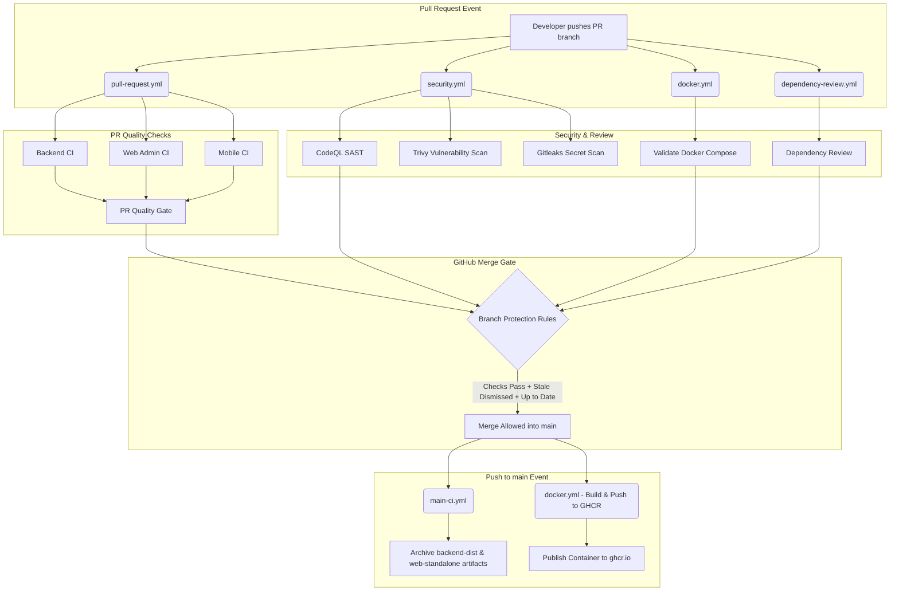

# GitHub Branch Protection & Quality Gate Guide

This guide details how to configure strict enterprise-grade quality gates and branch protection on your repository (`main` branch) to prevent breaking changes, untested commits, and security regressions from reaching production.

---

## 🛡️ Target Settings Checklist

In your repository on GitHub:
- [x] **Require a pull request before merging**
- [x] **Dismiss stale pull request approvals**
- [x] **Require approval of the most recent reviewable push**
- [x] **Require conversation resolution**
- [x] **Require status checks to pass before merging**
- [x] **Require branches to be up to date before merging**
- [x] **Do not allow bypassing the above settings**

---

## 📍 Step-by-Step GitHub Web Interface Setup

1. Open your repository on GitHub: `https://github.com/<your-org-or-user>/sofiya_bangles`
2. Navigate to **Settings** (top navigation bar).
3. In the left sidebar, under **Code and automation**, click **Branches**.
4. In the **Branch protection rules** section, click **Add branch protection rule** (or edit the existing rule for `main`).
5. Set **Branch name pattern**:
   ```
   main
   ```

### 1. Require Pull Request & Review Protections
Check:
- [x] **Require a pull request before merging**
  - **Required approvals**: `1` (or `2` depending on team size)
  - [x] **Dismiss stale pull request approvals when new commits are pushed**
    > *Why:* When someone approves a PR and subsequent commits are pushed, the previous approval is automatically reset. This guarantees that nobody sneaks unreviewed code into an already-approved PR.
  - [x] **Require approval of the most recent reviewable push**
    > *Why:* Ensures that the head commit being merged has received explicit approval, preventing race conditions or stealth modifications.

### 2. Require Conversation Resolution
Check:
- [x] **Require conversation resolution**
  > *Why:* Ensures all reviewer comments, code feedback, and discussions in the PR must be marked as "Resolved" before the merge button becomes active.

### 3. Require Status Checks & Up-To-Date Branches
Check:
- [x] **Require status checks to pass before merging**
- [x] **Require branches to be up to date before merging**
  > *Why:* Forces developers to update their branch with the latest `main` commit (merge or rebase) and re-run CI checks before merging. This eliminates merge conflicts and subtle integration breaks between parallel PRs.

**Select the Status Checks that must pass:**
In the search box under "Status checks that are required", search and check the following jobs created by our workflow:
- `PR Quality Gate` *(Consolidated gate from pull-request.yml)*
- `Backend CI` *(Backend TypeScript & unit tests)*
- `Web Admin Portal CI` *(Web lint, Vitest, & Next.js build)*
- `Mobile App CI` *(Expo TypeScript typecheck)*
- `CodeQL Security Analysis` *(SAST code analysis)*
- `Validate Docker Compose Configuration` *(Docker orchestration check)*

*(Note: If a status check hasn't appeared in the search box yet, trigger a PR once so GitHub registers the check name).*

### 4. Enforce Strict Admin Compliance
Check:
- [x] **Do not allow bypassing the above settings**
  > *Why:* By default, repository administrators and owners can bypass branch protection rules. Enabling this rule applies all checks strictly to everyone, including repository admins and organization owners.

Click **Save changes** (or **Create**) at the bottom of the page.

---

## 💻 Alternative: Automate via GitHub CLI (`gh`)

If you have the [GitHub CLI (`gh`)](https://cli.github.com/) installed and authenticated, you can apply these branch protections using the GitHub REST API:

```bash
gh api \
  --method PUT \
  -H "Accept: application/vnd.github+json" \
  /repos/{owner}/{repo}/branches/main/protection \
  --input - <<EOF
{
  "required_status_checks": {
    "strict": true,
    "contexts": [
      "PR Quality Gate",
      "Backend CI",
      "Web Admin Portal CI",
      "Mobile App CI"
    ]
  },
  "enforce_admins": true,
  "required_pull_request_reviews": {
    "dismiss_stale_reviews": true,
    "require_code_owner_reviews": false,
    "required_approving_review_count": 1,
    "require_last_push_approval": true
  },
  "required_conversation_resolution": true,
  "restrictions": null,
  "allow_force_pushes": false,
  "allow_deletions": false
}
EOF
```

---

## 📦 Workflow Architecture Overview


