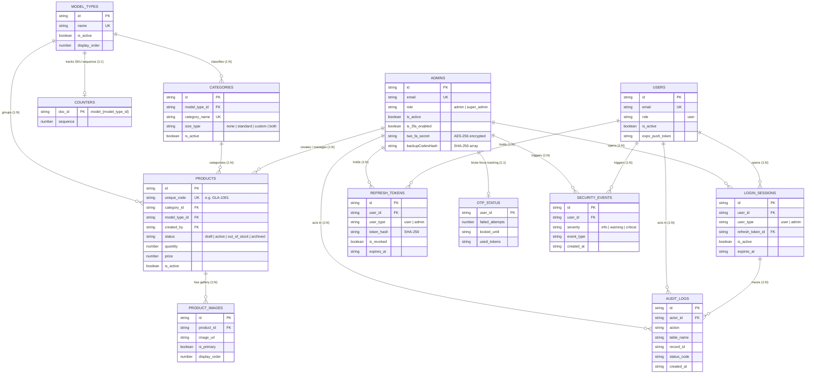

# Sofiya Bangles — Database Schema & Architecture Documentation

This document provides a comprehensive, production-grade reference for the **Google Cloud Firestore** database collections (tables) powering the **Sofiya Bangles** platform. It is designed to serve as the definitive architectural guide for developers, onboarding engineers, and system administrators.

---

## 📑 Table of Contents
1. [Architectural Overview & Core Design Principles](#1-architectural-overview--core-design-principles)
2. [Entity-Relationship Diagram (ERD)](#2-entity-relationship-diagram-erd)
3. [Master Collections Catalog](#3-master-collections-catalog)
   - [1. `admins`](#1-admins)
   - [2. `users`](#2-users)
   - [3. `categories`](#3-categories)
   - [4. `model_types`](#4-model_types)
   - [5. `products`](#5-products)
   - [6. `product_images`](#6-product_images)
   - [7. `counters`](#7-counters)
   - [8. `login_sessions`](#8-login_sessions)
   - [9. `refresh_tokens`](#9-refresh_tokens)
   - [10. `otp_status`](#10-otp_status)
   - [11. `security_events`](#11-security_events)
   - [12. `audit_logs`](#12-audit_logs)
4. [Cross-Collection Workflows & Lifecycle States](#4-cross-collection-workflows--lifecycle-states)
   - [4.1 Two-Factor Authentication & Session Lifecycle](#41-two-factor-authentication--session-lifecycle)
   - [4.2 Atomic Sequential SKU Generation](#42-atomic-sequential-sku-generation)
   - [4.3 Soft Delete & Archival Strategy](#43-soft-delete--archival-strategy)
   - [4.4 Data Retention & Automated Cleanup](#44-data-retention--automated-cleanup)
5. [Developer Guidelines for Future Expansion](#5-developer-guidelines-for-future-expansion)

---

## 1. Architectural Overview & Core Design Principles

Sofiya Bangles utilizes **Google Cloud Firestore** as its primary document database, orchestrated via the Node.js/TypeScript Express backend (`backend/src/`). 

### Core Architectural Decisions:
1. **Identity Collection Partitioning (`admins` vs `users`)**:
   - Customer accounts and administrative accounts are partitioned into two physically distinct collections.
   - **Security**: Admin records hold TOTP secrets, backup recovery codes, and brute-force lockout states that must never be exposed or co-mingled with customer search indexes.
   - **Performance**: Administrative logins query the compact `admins` collection first, avoiding full-table scans over large customer user bases.
2. **Normalized Relational Modeling in NoSQL**:
   - Relational integrity (Categories ↔ Model Types ↔ Products ↔ Images) is maintained through explicit UUID foreign keys with application-level consistency and batch operations (`db.batch()`).
3. **Optimistic & Atomic Operations**:
   - High-concurrency operations (e.g., SKU sequence numbering) employ Firestore Transactions (`db.runTransaction()`) to eliminate race conditions.
4. **Timezone Standardization**:
   - Audit and administrative display timestamps are normalized to **Indian Standard Time (IST, UTC+05:30)** using ISO 8601 strings with timezone offset (`YYYY-MM-DDTHH:mm:ss.sss+05:30`).
   - Ephemeral TTL fields (`expires_at`) use standard UTC ISO strings for exact machine comparison.

---

## 2. Entity-Relationship Diagram (ERD)

The following diagram illustrates the 12 active Firestore collections and their logical connections:



---

## 3. Master Collections Catalog

---

### 1. `admins`
* **Purpose & Why Used**: 
  Stores administrative staff profiles (`admin` and `super_admin`). Used exclusively by the **Web Admin Portal** and privileged backend tasks. Isolates administrative privileges, credential hashes, encrypted TOTP secrets, and recovery codes from the regular customer table.
* **Connections**:
  - `id` referenced as `created_by` in `products`.
  - `id` referenced in `login_sessions.user_id` (with `user_type: "admin"`).
  - `id` referenced in `refresh_tokens.user_id`.
  - `id` referenced in `otp_status.user_id`.
  - `id` referenced in `audit_logs.actor_id`.
  - `id` referenced in `revenue_ledger.admin_id`.
* **Data Schema**:
  | Field | Type | Required | Description |
  |---|---|---|---|
  | `id` | `string` | Yes | UUID or Firebase Auth UID |
  | `full_name` | `string` | Yes | Admin staff full name |
  | `email` | `string` | Yes | Unique login email address |
  | `password_hash` | `string` | Yes | Bcrypt password hash |
  | `phone` | `string \| null` | No | Contact phone number |
  | `avatar_url` | `string \| null` | No | Profile photo CDN URL |
  | `role` | `string` | Yes | Enum: `'admin'` \| `'super_admin'` |
  | `is_active` | `boolean` | Yes | Flag determining whether account can log in |
  | `is_2fa_enabled` | `boolean` | Yes | Flag indicating whether TOTP 2FA is active |
  | `two_fa_secret` | `string \| null` | No | AES-256 encrypted base32 secret for authenticator apps |
  | `pendingTwoFactorSecretEncrypted` | `string \| null` | No | Temporary secret pending first successful verification |
  | `backupCodesHash` | `string[]` | No | Array of 10 SHA-256 hashed single-use backup recovery codes |
  | `failedOtpAttempts` | `number` | No | Consecutive failed 2FA attempts count |
  | `accountLockedUntil` | `string \| null` | No | Lockout expiration timestamp (UTC/IST ISO) |
  | `twoFactorEnabledAt` | `string \| null` | No | Timestamp when 2FA was originally enabled |
  | `two_fa_updated_at` | `string \| null` | No | Timestamp when 2FA secret was last regenerated |
  | `created_at` | `string` | Yes | IST ISO timestamp |
  | `updated_at` | `string` | Yes | IST ISO timestamp |
* **States Held**:
  - **Account Status**: Active (`is_active = true`) vs Deactivated (`is_active = false`).
  - **2FA Status**: Not Enrolled (`is_2fa_enabled = false`, `pending = null`) → Enrolling (`pending != null`) → Fully Enrolled (`is_2fa_enabled = true`).
  - **Lockout Status**: Unlocked (`accountLockedUntil == null` or past) vs Locked (`accountLockedUntil > now`).
  - **Role Tier**: `admin` (catalog & order management) vs `super_admin` (commission, staff management, audit view).

---

### 2. `users`
* **Purpose & Why Used**: 
  Stores customer accounts registered via the **Mobile App** (React Native/Expo). Holds customer profile information, push notification device tokens, and links to customer transactions (favorites, orders, custom size preferences).
* **Connections**:
  - `id` referenced in `favorites.user_id`.
  - `id` referenced in `orders.user_id`.
  - `id` referenced in `cart.user_id`.
  - `id` referenced in `user_size_preferences.user_id`.
  - `id` referenced in `login_sessions.user_id` (with `user_type: "user"`).
  - `id` referenced in `refresh_tokens.user_id`.
  - `id` referenced in `notifications.user_id`.
* **Data Schema**:
  | Field | Type | Required | Description |
  |---|---|---|---|
  | `id` | `string` | Yes | Unique Customer UUID / Firebase UID |
  | `full_name` | `string` | Yes | Customer name |
  | `email` | `string` | Yes | Customer email address |
  | `phone` | `string \| null` | No | Contact phone number for delivery |
  | `avatar_url` | `string \| null` | No | Profile picture URL (Firebase Storage) |
  | `role` | `string` | Yes | Fixed value: `'user'` |
  | `password_hash` | `string` | No | Bcrypt hash (or empty if using Google Sign-In) |
  | `expo_push_token` | `string \| null` | No | Expo push token for mobile order and marketing alerts |
  | `is_active` | `boolean` | Yes | Active customer account flag |
  | `created_at` | `string` | Yes | IST ISO timestamp |
  | `updated_at` | `string` | Yes | IST ISO timestamp |
* **States Held**:
  - **Account Status**: Active (`is_active = true`) vs Blocked/Suspended (`is_active = false`).
  - **Push Notification Reachability**: Registered (`expo_push_token != null`) vs Unregistered (`null`).

---

### 3. `categories`
* **Purpose & Why Used**: 
  Represents specific bangle product categories (e.g., "Bridal Bangles", "Silk Thread Bangles", "Kada", "Daily Wear"). Defines how products within the category handle sizing (standard sizing, custom wrist measurements, or fixed sizes).
* **Connections**:
  - Belongs to `model_types` via `model_type_id`.
  - Parent to `products` via `products.category_id`.
  - Referenced in `user_size_preferences.category_id`.
* **Data Schema**:
  | Field | Type | Required | Description |
  |---|---|---|---|
  | `id` | `string` | Yes | Category UUID |
  | `model_type_id` | `string` | Yes | Foreign Key pointing to parent `model_types.id` |
  | `category_name` | `string` | Yes | Unique category name (case-insensitive) |
  | `image_url` | `string \| null` | No | Cover image for category thumbnail/banner |
  | `display_order` | `number` | Yes | Numeric sort order for frontend navigation menus |
  | `is_active` | `boolean` | Yes | Visibility flag in mobile/web store |
  | `size_type` | `string` | No | Enum: `'none'` \| `'standard'` \| `'custom'` \| `'both'` |
  | `standard_sizes` | `string[]` | No | Predefined size choices (e.g. `["2.2", "2.4", "2.6", "2.8", "2.10"]`) |
  | `custom_measurement_fields` | `string[]` | No | Required measurement prompts for custom orders |
  | `created_at` | `string` | Yes | ISO timestamp |
  | `updated_at` | `string` | Yes | ISO timestamp |
  | `deleted_at` | `string \| null` | No | Soft-delete timestamp (null if active) |
* **States Held**:
  - **Catalog Visibility**: Active (`is_active = true`, `deleted_at = null`) vs Soft-Deleted (`is_active = false`, `deleted_at != null`).
  - **Sizing Mode**:
    * `'none'`: Free size / single size bangle.
    * `'standard'`: Pre-defined standard sizes.
    * `'custom'`: Tailored custom measurements required from customer.
    * `'both'`: Customer can choose between standard sizes or custom specifications.

---

### 4. `model_types`
* **Purpose & Why Used**: 
  Top-level taxonomy defining the core material/model classification of bangles (e.g., "Metal", "Glass", "Plastic", "Velvet", "Gold Plated"). Model types drive the 3-letter SKU prefix (e.g., `GLA-` for Glass) and partition categories.
* **Connections**:
  - Parent to `categories` (via `categories.model_type_id`).
  - Referenced in `products.model_type_id`.
  - Maps 1:1 with `counters` document ID (`model_{id}`).
* **Data Schema**:
  | Field | Type | Required | Description |
  |---|---|---|---|
  | `id` | `string` | Yes | Model Type UUID |
  | `name` | `string` | Yes | Name of material/model (e.g., "Glass Bangles") |
  | `is_active` | `boolean` | Yes | Operational flag |
  | `display_order` | `number` | No | Sorting order in frontend filter tabs |
  | `created_at` | `string` | Yes | ISO timestamp |
  | `updated_at` | `string` | Yes | ISO timestamp |
  | `deleted_at` | `string \| null` | No | Soft-delete timestamp |
* **States Held**:
  - **Status**: Active (`is_active: true`, `deleted_at: null`) vs Inactive/Archived (`is_active: false`).

---

### 5. `products`
* **Purpose & Why Used**: 
  The central catalog entity representing each individual bangle product. Stores pricing, stock level, ratings, product status, and metadata.
* **Connections**:
  - Belongs to `categories` via `category_id`.
  - Belongs to `model_types` via `model_type_id`.
  - Belongs to `admins` via `created_by`.
  - Parent to `product_images` (1:N via `product_images.product_id`).
  - Parent to `product_variants` (1:N via `product_variants.product_id`).
  - Referenced in `favorites`, `cart_items`, `order_items`, `audit_logs`.
* **Data Schema**:
  | Field | Type | Required | Description |
  |---|---|---|---|
  | `id` | `string` | Yes | Product UUID |
  | `unique_code` | `string` | Yes | Human-readable unique SKU code (e.g. `GLA-1001`) |
  | `product_name` | `string` | Yes | Display title of the bangle product |
  | `description` | `string \| null` | No | Detailed product description & craftsmanship notes |
  | `price` | `number` | Yes | Base selling price (in INR) |
  | `image_url` | `string \| null` | No | Primary hero image URL |
  | `category_id` | `string` | Yes | Foreign Key to `categories.id` |
  | `model_type_id` | `string` | Yes | Foreign Key to `model_types.id` |
  | `quantity` | `number` | Yes | Total inventory stock count on hand |
  | `likes` | `number` | Yes | Real-time counter of customer favorites |
  | `rating` | `number` | Yes | Aggregate rating (0.0 to 5.0) |
  | `reviews` | `number` | Yes | Total count of customer reviews |
  | `is_active` | `boolean` | Yes | Customer store visibility flag |
  | `status` | `string` | No | Enum: `'draft'` \| `'active'` \| `'out_of_stock'` \| `'archived'` |
  | `has_variants` | `boolean` | No | True if specific size/color variants exist in `product_variants` |
  | `accepts_custom_size` | `boolean` | No | True if customers can request tailored sizing |
  | `custom_size_price` | `number \| null` | No | Surcharge price for custom sizing orders |
  | `created_by` | `string` | No | Admin UID who added the item |
  | `created_by_role` | `string` | No | Enum: `'admin'` \| `'super_admin'` |
  | `updated_by` | `string \| null` | No | Admin UID who last modified the item |
  | `created_at` | `string` | Yes | ISO timestamp |
  | `updated_at` | `string` | Yes | ISO timestamp |
  | `deleted_at` | `string \| null` | No | Soft-delete timestamp |
* **States Held**:
  - **Lifecycle States (`status`)**:
    * `draft`: Initial creation; visible only to admin staff.
    * `active`: Live in the store and open for customer ordering.
    * `out_of_stock`: Stock quantity has dropped to 0.
    * `archived`: Soft-deleted product hidden from store searches, restorable.
  - **Inventory Health**: In Stock (`quantity > 5`) → Low Stock (`1 <= quantity <= 5`) → Out of Stock (`quantity == 0`).

---

### 6. `product_images`
* **Purpose & Why Used**: 
  Stores gallery images for each product. Allows each bangle to feature multiple high-resolution photos (wrist view, packaging, angle views) hosted on Cloudinary CDN.
* **Connections**:
  - Parent: `products` (via `product_id`).
  - When a product is updated or deleted, child records in `product_images` are updated or removed via atomic batch commit.
* **Data Schema**:
  | Field | Type | Required | Description |
  |---|---|---|---|
  | `id` | `string` | Yes | Image Record UUID |
  | `product_id` | `string` | Yes | Foreign Key referencing `products.id` |
  | `image_url` | `string` | Yes | Secure Cloudinary CDN URL |
  | `public_id` | `string \| null` | No | Cloudinary public asset ID (used for deletion & transformations) |
  | `alt_text` | `string \| null` | No | Accessibility / SEO text |
  | `display_order` | `number` | Yes | Zero-indexed display sorting order (0 = first) |
  | `is_primary` | `boolean` | Yes | `true` if this image is the primary catalog thumbnail |
  | `created_at` | `string` | Yes | ISO timestamp |
  | `updated_at` | `string` | Yes | ISO timestamp |
* **States Held**:
  - **Primary Designation**: Cover Image (`is_primary: true`) vs Gallery Secondary (`is_primary: false`).

---

### 7. `counters`
* **Purpose & Why Used**: 
  Solves the distributed NoSQL race condition for incremental SKU generation. Guarantees strictly sequential, gapless, human-readable product codes (e.g. `GLA-1001`, `GLA-1002`, `MET-1001`) by utilizing atomic Firestore transactions.
* **Connections**:
  - Document ID directly incorporates `model_types.id`: format is `model_{model_type_id}`.
  - Read and incremented during `generateNextProductSequenceDb()` before creating a `products` document.
* **Data Schema**:
  | Field | Type | Required | Description |
  |---|---|---|---|
  | `doc.id` | `string` | Yes | Pattern: `model_{modelTypeId}` (e.g. `model_2df6ab4e...`) |
  | `sequence` | `number` | Yes | Integer counter. Initialized at 1001 and incremented by 1 per product. |
* **States Held**:
  - Monotonically increasing numerical counter state (`1001, 1002, 1003...`).

---

### 8. `login_sessions`
* **Purpose & Why Used**: 
  Tracks active user login sessions across both Web and Mobile apps. Powers concurrent device tracking, session timeout enforcement, device inspection, and remote logout ("Sign out of all devices").
* **Connections**:
  - `user_id` + `user_type` connects polymorphically to `users` or `admins`.
  - `refresh_token_id` references `refresh_tokens.id`.
  - `id` referenced in `audit_logs.session_id`.
* **Data Schema**:
  | Field | Type | Required | Description |
  |---|---|---|---|
  | `id` | `string` | Yes | Session UUID |
  | `user_id` | `string` | Yes | Foreign Key referencing `admins.id` or `users.id` |
  | `user_type` | `string` | Yes | Enum: `'user'` \| `'admin'` |
  | `refresh_token_id` | `string` | Yes | Foreign Key to paired `refresh_tokens.id` |
  | `device_info` | `object` | Yes | JSON containing `ip_address`, `client_type` (`web`/`mobile`), `browser`, `os`, `user_agent` |
  | `is_active` | `boolean` | Yes | Flag indicating if session is currently valid |
  | `login_at` | `string` | Yes | Session initiation timestamp (ISO) |
  | `last_active_at` | `string` | Yes | Timestamp of most recent authenticated request |
  | `logout_at` | `string \| null` | No | Timestamp of voluntary logout or session revocation |
  | `expires_at` | `string` | Yes | Expiration timestamp (e.g. login_at + 7 days for admin, 30 days for user) |
* **States Held**:
  - **Session State**: Active (`is_active = true`, `logout_at = null`, `expires_at > now`) vs Deactivated (`is_active = false`, `logout_at != null`) vs Expired (`expires_at < now`).
  - **Lifecycle**: Expired documents are permanently purged by the hourly backend cleanup job.

---

### 9. `refresh_tokens`
* **Purpose & Why Used**: 
  Implements secure JWT Refresh Token rotation. Stores cryptographically hashed refresh tokens in the database to allow silent access token renewals while enabling immediate server-side revocation on logout or token compromise.
* **Connections**:
  - `user_id` references `users.id` or `admins.id`.
  - Referenced by `login_sessions.refresh_token_id`.
* **Data Schema**:
  | Field | Type | Required | Description |
  |---|---|---|---|
  | `id` | `string` | Yes | Token Record UUID |
  | `user_id` | `string` | Yes | Foreign Key to user/admin |
  | `user_type` | `string` | Yes | Enum: `'user'` \| `'admin'` |
  | `token_hash` | `string` | Yes | SHA-256 hash of the plain refresh token (raw token is never stored) |
  | `is_revoked` | `boolean` | Yes | Revocation status flag |
  | `created_at` | `string` | Yes | ISO creation timestamp |
  | `expires_at` | `string` | Yes | Absolute expiration timestamp |
  | `revoked_at` | `string \| null` | No | Timestamp when token was invalidated |
  | `platform` | `string \| null` | No | Enum: `'web'` \| `'mobile'` |
* **States Held**:
  - **Token State**: Active & Valid (`is_revoked = false`, `expires_at > now`) vs Revoked (`is_revoked = true`) vs Expired (`expires_at < now`).
  - **Lifecycle**: Cleaned up via token rotation or deleted by automated cleanup.

---

### 10. `otp_status`
* **Purpose & Why Used**: 
  Tracks failed Two-Factor Authentication (2FA/TOTP) attempts per user to prevent brute-force attacks against 6-digit one-time passwords. Implements replay-attack prevention and automatic 15-minute account lockouts.
* **Connections**:
  - Document ID is the `userId` directly (1:1 mapping with `admins.id`).
* **Data Schema**:
  | Field | Type | Required | Description |
  |---|---|---|---|
  | `user_id` | `string` | Yes | Document Key & Admin User ID |
  | `failed_attempts` | `number` | Yes | Counter of consecutive incorrect OTP entries |
  | `locked_until` | `string \| null` | No | ISO timestamp until which all verification attempts are rejected |
  | `last_failed_at` | `string \| null` | No | Timestamp of the most recent failure |
  | `used_tokens` | `string[]` | No | Array of recently verified tokens within the 2-minute time window |
* **States Held**:
  - **Security Gate States**:
    * `Clear`: `failed_attempts: 0`, `locked_until: null` (normal access).
    * `Warning`: `1 <= failed_attempts < 5` (attempt count increments).
    * `Brute Force Locked`: `failed_attempts >= 5`, `locked_until: now + 15 mins`. All OTP attempts immediately rejected with HTTP 429.

---

### 11. `security_events`
* **Purpose & Why Used**: 
  High-severity immutable security audit log. Captures threat intelligence, suspicious logins, account lockouts, 2FA secret rotations, and token tampering. Retained for **365 days** (`SECURITY_EVENT_RETENTION_DAYS`) for forensic analysis.
* **Connections**:
  - Correlates with `admins.id` or `users.id` via `user_id`.
* **Data Schema**:
  | Field | Type | Required | Description |
  |---|---|---|---|
  | `id` | `string` | Yes | Security Event UUID |
  | `user_id` | `string \| null` | No | Targeted or actor user ID |
  | `user_type` | `string \| null` | No | Enum: `'user'` \| `'admin'` |
  | `event_type` | `string` | Yes | E.g., `'BRUTE_FORCE_LOCK'`, `'ACCOUNT_LOCKED'`, `'SUSPICIOUS_LOGIN'`, `'2FA_ROTATED'` |
  | `severity` | `string` | Yes | Enum: `'info'` \| `'warning'` \| `'critical'` |
  | `ip_address` | `string` | Yes | Client IP address |
  | `device_info` | `object` | Yes | Detailed client user-agent and OS metadata |
  | `details` | `string \| null` | No | Contextual diagnostic message or JSON string |
  | `created_at` | `string` | Yes | ISO timestamp |
* **States Held**:
  - Immutable historical record. Severity levels (`info`, `warning`, `critical`).

---

### 12. `audit_logs`
* **Purpose & Why Used**: 
  Comprehensive business activity audit trail and API failure monitor. Records every data modification (CRUD on products, categories, stock changes) and automatically captures all API HTTP errors (status >= 400). Default retention is **90 days** (`AUDIT_RETENTION_DAYS`).
* **Connections**:
  - `actor_id` connects to `admins.id` or `users.id`.
  - `table_name` + `record_id` connects polymorphically to any collection document (e.g. `table_name: "products"`, `record_id: "prod_123"`).
  - `session_id` connects to `login_sessions.id`.
* **Data Schema**:
  | Field | Type | Required | Description |
  |---|---|---|---|
  | `id` | `string` | Yes | Audit Log UUID |
  | `actor_id` | `string \| null` | No | User/Admin ID who executed the action |
  | `user_type` | `string \| null` | No | Enum: `'admin'` \| `'super_admin'` \| `'user'` \| `'system'` |
  | `action` | `string` | Yes | Action verb: `'PRODUCT_CREATED'`, `'PRODUCT_SOLD'`, `'CATEGORY_UPDATED'`, `'API_FAILURE'`, `'LOGIN_SUCCESS'` |
  | `table_name` | `string \| null` | No | Target collection name (e.g. `'products'`) |
  | `record_id` | `string \| null` | No | Affected document ID |
  | `old_data` | `object \| null` | No | Document JSON snapshot before change |
  | `new_data` | `object \| null` | No | Document JSON snapshot after change |
  | `correlation_id` | `string \| null` | No | Distributed tracing request ID |
  | `session_id` | `string \| null` | No | Paired `login_sessions.id` |
  | `ip_address` | `string` | Yes | Client IP address |
  | `api_endpoint` | `string \| null` | No | E.g. `'POST /api/products'` (for API error logs) |
  | `api_error` | `string \| null` | No | Error message if request failed |
  | `status_code` | `number \| null` | No | HTTP status code (e.g. 400, 401, 404, 500) |
  | `created_at` | `string` | Yes | IST ISO timestamp (`YYYY-MM-DDTHH:mm:ss.sss+05:30`) |
* **States Held**:
  - **Before/After State**: Captures data deltas (`old_data` → `new_data`) enabling historical rollback inspection and sales analytics calculations.

---

## 4. Cross-Collection Workflows & Lifecycle States

### 4.1 Two-Factor Authentication & Session Lifecycle
When an admin logs into the portal:
```
1. Admin enters email & password
   └── Backend checks `admins` collection
       └── If valid: Generates temporary record in `login_challenges` (TTL: 10m)
       └── Returns `otp_pending_token` to frontend

2. Admin submits 6-digit TOTP code
   └── Backend checks `otp_status` for user lockout
       ├── If failed_attempts >= 5 and locked_until > now:
       │   └── Returns HTTP 429 Locked; logs to `security_events`
       └── If valid:
           ├── Resets `otp_status.failed_attempts = 0`
           ├── Deletes temporary `login_challenges` doc
           ├── Generates `refresh_tokens` record (hashed token)
           ├── Generates `login_sessions` record (device metadata)
           ├── Writes `LOGIN_SUCCESS` to `audit_logs`
           └── Returns access_token + refresh_token
```

### 4.2 Atomic Sequential SKU Generation
When an admin creates a product under a model type (e.g., Glass Bangles with ID `mt_glass`):
```
1. Backend initiates Firestore Transaction (`db.runTransaction`)
2. Reads doc `counters/model_mt_glass`
3. Reads existing sequence (e.g., 1042)
4. Increments sequence to 1043 atomically
5. Saves { sequence: 1043 } back to `counters/model_mt_glass`
6. Formats SKU: "GLA-1043"
7. Inserts `products` doc with `unique_code = "GLA-1043"`
8. Inserts gallery images into `product_images` via `batch.commit()`
```

### 4.3 Soft Delete & Archival Strategy
In compliance with e-commerce data integrity principles, categories, model types, and products are **never hard-deleted** if they have associated sales or orders:
- Setting `is_active = false`, `status = "archived"`, and `deleted_at = new Date().toISOString()`.
- Catalog queries filter with `.where("is_active", "==", true)` to instantly hide archived items from customers without breaking historical order lines.

### 4.4 Data Retention & Automated Cleanup
The backend server (`backend/src/server.ts`) runs a recurring background cleanup worker every hour (`SESSION_CLEANUP_INTERVAL_MS = 3600000`):

| Collection | Retention Rule | Cleanup Function | Action |
|---|---|---|---|
| `login_challenges` | `expires_at < now` (10 mins) | `cleanupExpiredChallenges()` | Hard delete expired challenges |
| `login_sessions` | `expires_at < now - grace_period` | `cleanupExpiredSessions()` | Hard delete inactive expired sessions |
| `refresh_tokens` | `expires_at < now` | `cleanupExpiredTokens()` | Hard delete expired tokens |
| `used_otp_tokens` | `expires_at < now` (2 mins) | `cleanupExpiredUsedOtpTokens()` | Hard delete replay prevention tokens |
| `audit_logs` | `created_at < now - 90 days` | `cleanupOldAuditLogs()` | Prune logs older than `AUDIT_RETENTION_DAYS` |
| `security_events` | `created_at < now - 365 days` | `cleanupOldSecurityEvents()` | Prune events older than `SECURITY_EVENT_RETENTION_DAYS` |

---

## 5. Developer Guidelines for Future Expansion

1. **Adding New Fields**:
   - Always update `backend/src/shared/types/index.ts` first.
   - Use optional typing (`field?: type`) for backward compatibility with documents already saved in Firestore.
2. **Never Query Without Indexes**:
   - When introducing compound filters (e.g. `where("category_id", "==").where("is_active", "==").orderBy("created_at")`), ensure the composite index is declared in `firestore.indexes.json`.
3. **Atomic Multi-Document Writes**:
   - Whenever creating or modifying parent-child entities (e.g. `products` + `product_images`), always use `db.batch()` or `db.runTransaction()`. Never write them in independent `await` calls that could leave orphaned documents on failure.
4. **Timezone Handling**:
   - Always import `nowISTISO()` from `src/shared/utils/datetime.ts` for human-readable audit timestamps.
   - Always use standard `.toISOString()` for mathematical comparisons or TTL expiration checks.
