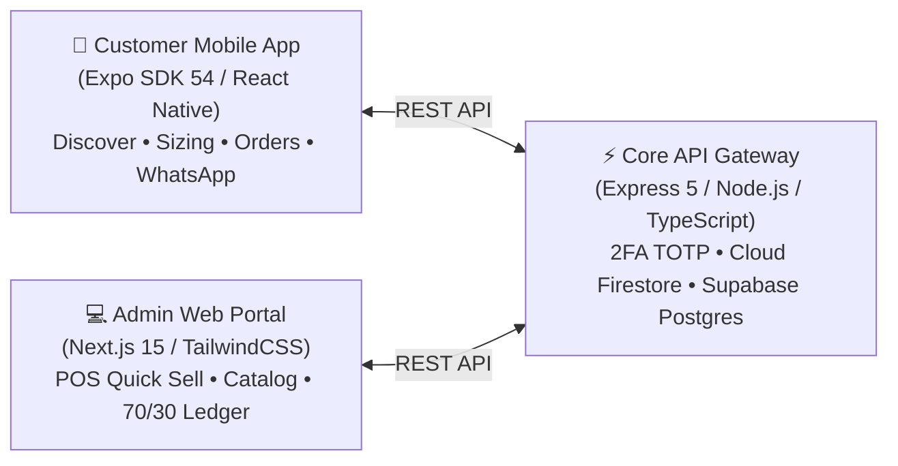

# 💍 Sofiya Bangles — Omnichannel E-Commerce & Retail Platform

<div align="center">


[](https://nodejs.org/)
[](https://nextjs.org/)
[](https://expo.dev/)
[](https://www.typescriptlang.org/)
[](https://tailwindcss.com/)
[](https://www.docker.com/)
[](https://github.com/Jaleel-Shaik/sofiyaBangles/security)
[](https://trivy.dev/)

**The premier digital destination for handcrafted, bridal, gold-plated, and designer bangles.**  
Bridging traditional South Asian jewelry craftsmanship with modern omnichannel commerce.

[Explore PRD](docs/prd.md) • [System Architecture](docs/architecture.md) • [Engineering Rules](docs/rules.md) • [Design System](docs/design.md) • [Agent Memory](docs/memory.md)

</div>

---

## 📑 Table of Contents
1. [Platform Overview](#-platform-overview)
2. [Monorepo Architecture](#-monorepo-architecture)
3. [Key Features](#-key-features)
4. [Documentation Library](#-documentation-library)
5. [Developer Quick Start](#-developer-quick-start)
   - [Prerequisites](#prerequisites)
   - [1. Backend Setup](#1-backend-setup-backend)
   - [2. Web Admin Portal Setup](#2-web-admin-portal-setup-web)
   - [3. Mobile App Setup](#3-mobile-app-setup-mobile)
6. [Testing & Quality Assurance](#-testing--quality-assurance)
7. [Docker & Containerized Deployment](#-docker--containerized-deployment)
8. [Security & Compliance](#-security--compliance)
9. [Contributing & Development Standards](#-contributing--development-standards)
10. [License](#-license)

---

## 🌟 Platform Overview

**Sofiya Bangles** is an enterprise-grade, omnichannel jewelry platform designed to streamline direct-to-consumer mobile discovery and retail point-of-sale operations. The platform is composed of three interconnected sub-systems:



* **📱 Mobile Shopper Experience**: High-speed shopping app featuring a Millimeter Bangle Sizing Suite, custom diameter submissions, offline-resilient wishlist, and one-tap direct WhatsApp inquiry.
* **💻 Admin Web Portal**: Multi-role administrative dashboard with hardware-backed 2FA (Google Authenticator), fast in-store barcode/code "Quick Sell" modal, product variant management, and 70/30 platform revenue split controls.
* **⚡ Backend API Engine**: Resilient Node.js / Express 5 service implementing Clean Architecture with AES-256-CBC encrypted 2FA secrets, Firestore document storage, and Supabase PostgreSQL financial ledgers.

---

## 🏛️ Monorepo Architecture

```
sofiya_bangles/
├── 📁 backend/                # Express 5 / Node.js REST API
│   ├── src/features/          # Modular slices: auth, product, order, category, admin
│   ├── src/shared/            # Cross-cutting: crypto (AES-256), config, middlewares
│   └── tests/                 # 20+ automated unit and integration tests
├── 📁 web/                    # Next.js 15 App Router Admin Portal
│   ├── app/dashboard/         # Role-protected management routes (activity, orders, products)
│   ├── features/              # Feature components: QuickSellModal, ProductForm, 2FA
│   └── src/components/ui/     # Reusable design-token primitives
├── 📁 mobile/                 # React Native / Expo SDK 54 Customer Application
│   ├── app/                   # Expo Router file-based screens
│   ├── features/              # Native screens: Home, Sizing, Categories, Wishlist
│   └── src/utils/secureStore  # Universal storage bridge (SecureStore + Web localStorage)
├── 📁 docs/                   # Centralized Architecture & Engineering Constitution
│   ├── prd.md                 # Product Requirements Document
│   ├── architecture.md        # Full-Stack System Architecture & Diagrams
│   ├── rules.md               # Engineering Rules, Anti-Patterns & Standards
│   ├── design.md              # UI/UX Design System, Typography & Color Tokens
│   └── memory.md              # Context Anchor & Architectural Decision Records
├── .github/workflows/         # Automated CI/CD, CodeQL SAST, Trivy, Docker Buildx
├── docker-compose.yml         # Multi-container production deployment
└── README.md
```

---

## ✨ Key Features

| Domain | Feature | Description |
| :--- | :--- | :--- |
| **Mobile Retail** | **Bangle Sizing Suite** | Interactive sizing selector (2-2 to 2-10) with exact millimeter diameter guide and custom size requests. |
| **Mobile Retail** | **Instant WhatsApp Order** | Direct checkout routing pre-filled SKU, size, and quantities to the store's business line. |
| **Store POS** | **Quick Sell Modal** | Instant barcode / code scan modal enabling cashiers to deduct stock and record buyer info in $< 10\text{ seconds}$. |
| **Security** | **Hardware-Backed 2FA** | Google Authenticator TOTP with AES-256-CBC at-rest encryption and 10 single-use backup recovery codes. |
| **Finance** | **70/30 Commission Engine** | Super-admin controlled platform commission settings allocating revenue per completed transaction. |
| **Inventory** | **Variant & Image Studio** | Multi-image Cloudinary uploads with WebP optimization, auto-compression, and size variant matrices. |

---

## 📚 Documentation Library

For in-depth guides, inspect the dedicated documents in the [`docs/`](docs/) directory:

* 📄 **[Product Requirements Document (PRD)](docs/prd.md)** — Full business goals, user personas, functional matrices, and release roadmap.
* 🏗️ **[System Architecture](docs/architecture.md)** — Clean architecture layering, dependency graphs, distributed database topology, and API contracts.
* 📜 **[Engineering Constitution & Rules](docs/rules.md)** — Code standards, anti-patterns to flag, async patterns, component reusability, and testing pyramid.
* 🎨 **[UI/UX Design System & Typography](docs/design.md)** — Sofiya Rose & Bangle Gold palette, Playfair Display & Inter typography, 44pt touch targets, and 8pt layout grid.
* 🧠 **[Agent Memory & Decision Log](docs/memory.md)** — Immutable architectural decision records (ADRs), known gotchas, and security invariants.
* 💾 **[Database Architecture & Schema Guide](DATABASE_SCHEMA_DOCUMENTATION.md)** — Comprehensive documentation of the 12 Firestore collections and PostgreSQL ledgers.
* 🐳 **[Docker Setup & Deployment Guide](DOCKER_GUIDE.md)** — Container buildx commands, environment files, and compose instructions.
* 🌿 **[Branch Protection & Git Workflow](BRANCH_PROTECTION_GUIDE.md)** — PR review standards, conventional commits, and merge requirements.

---

## 🚀 Developer Quick Start

### Prerequisites
* **Node.js**: `v20.x` or `v22.x` (LTS recommended)
* **Package Manager**: `npm` (v10+)
* **Docker & Buildx**: Docker 26+ (optional for containerized execution)
* **Mobile Tooling**: Expo CLI (`npx expo`), Android Studio (for Android emulator) or Xcode (for iOS simulator)

---

### 1. Backend Setup (`backend/`)

```bash
# Navigate to backend directory
cd backend

# Install dependencies
npm install

# Configure environment
cp .env.example .env
# Fill in your Firebase service-account.json and DB credentials in .env

# Run development server (with hot reload on port 5000)
npm run dev

# Run automated tests
npm test
```

---

### 2. Web Admin Portal Setup (`web/`)

```bash
# Navigate to web directory
cd web

# Install dependencies
npm install

# Start Next.js development server (runs on port 3000)
npm run dev
```

Visit [`http://localhost:3000`](http://localhost:3000) in your browser.

---

### 3. Mobile App Setup (`mobile/`)

```bash
# Navigate to mobile directory
cd mobile

# Install dependencies
npm install

# Launch Expo development client
npx expo start

# Run on Android Emulator
npx expo run:android

# Run on Web (Browser Preview)
npx expo start --web
```

---

## 🧪 Testing & Quality Assurance

The project enforces strict automated testing across all modules:

```bash
# Run Backend unit & integration test suites
cd backend
npm test

# Run TypeScript typechecks across all 3 applications
cd backend && npx tsc --noEmit
cd ../web && npx tsc --noEmit
cd ../mobile && npx tsc --noEmit
```

* **Test Suite**: 20/20 Passing tests covering TOTP generation, AES-256 decryption, product stock deductions, and SuperAdmin 2FA flows.
* **Type Coverage**: $100\%$ strict TypeScript with zero compilation errors.

---

## 🐳 Docker & Containerized Deployment

Run the complete platform locally using Docker Compose:

```bash
# Build and run backend and web containers
docker compose up -d --build

# Inspect container health
docker compose ps

# View live service logs
docker compose logs -f
```

For detailed containerization guides, refer to [DOCKER_GUIDE.md](DOCKER_GUIDE.md).

---

## 🔒 Security & Compliance

* **CodeQL SAST**: Enforced on all pull requests with the `security-and-quality` query suite.
* **Trivy Vulnerability Scanner**: Verified via `aquasecurity/trivy-action@v0.36.0`.
* **Zero Hardcoded Credentials**: Verified with Gitleaks and automated secret scanning.
* **AES-256-CBC Encryption**: Dynamic key derivation with per-record random IVs for all 2FA secrets.

---

## 🤝 Contributing & Development Standards

1. Create a feature branch from `feature-development`:
   ```bash
   git checkout -b feat/your-feature-name
   ```
2. Follow the [Engineering Rules](docs/rules.md) and [Design System](docs/design.md).
3. Commit using Conventional Commits:
   ```bash
   git commit -m "feat(catalog): add millimeter diameter customizer"
   ```
4. Push and open a Pull Request targeting `feature-development`.

---

## 📄 License

This project is proprietary and confidential.  
© 2026 **Sofiya Bangles**. All rights reserved.
