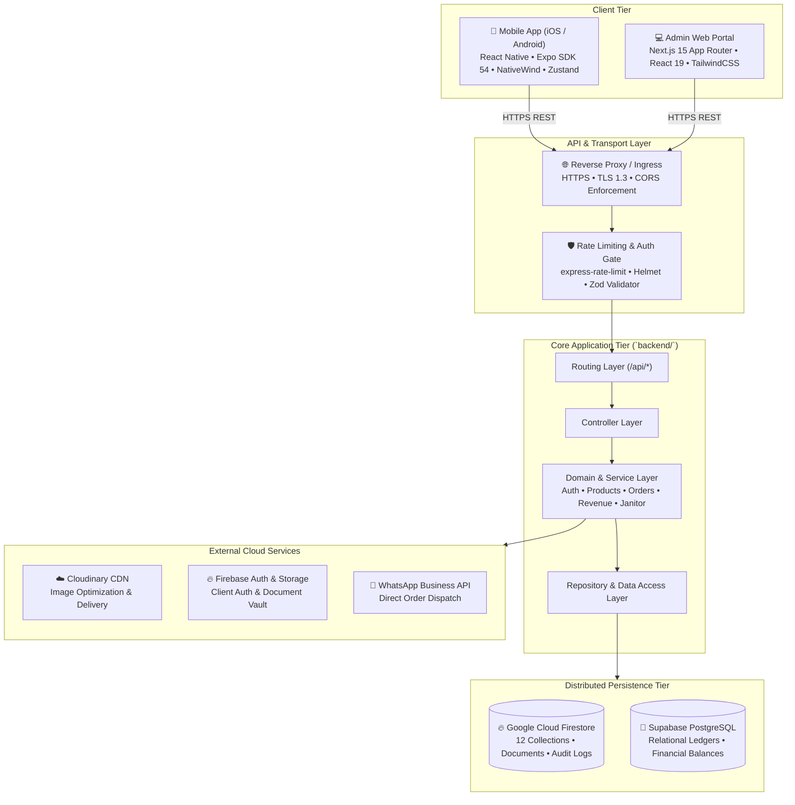
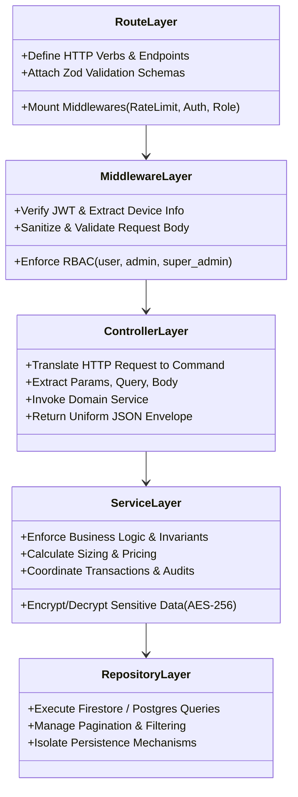
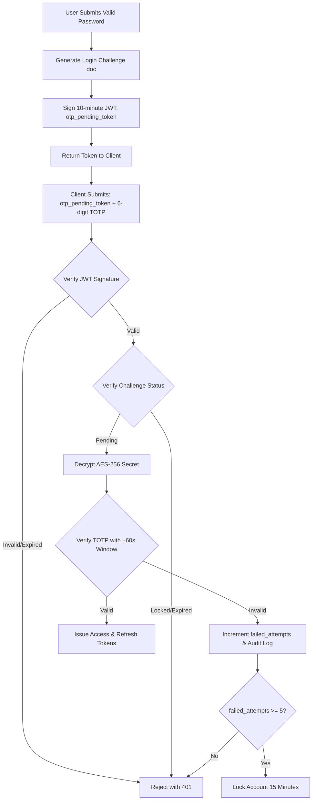
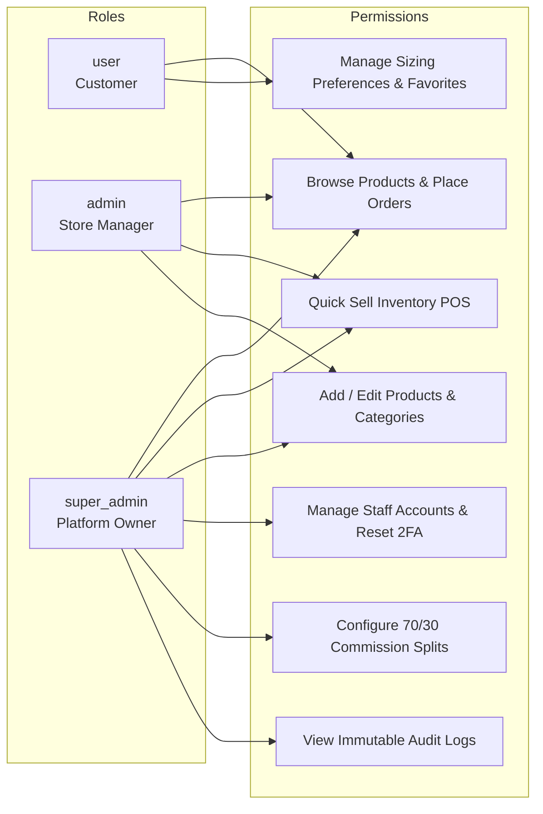
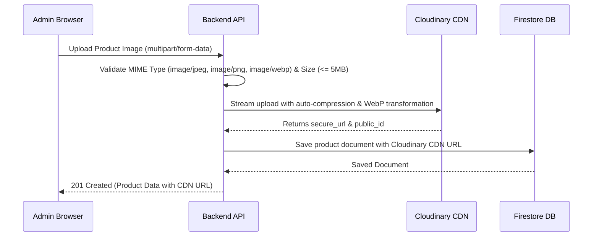

# 🏗️ Sofiya Bangles — Full-Stack System Architecture

> **Document Version**: 2.0.0  
> **Target Audience**: Backend Engineers, Frontend Engineers, DevOps, System Architects  
> **Status**: Living Architecture Specification  
> **Last Updated**: September 2026  

---

## 📑 Table of Contents
1. [High-Level System Topology](#-high-level-system-topology)
2. [Clean Architecture Layering Standard](#-clean-architecture-layering-standard)
3. [Component Directory Structures](#-component-directory-structures)
   - [Backend Architecture (`backend/`)](#1-backend-architecture-backend)
   - [Web Admin Architecture (`web/`)](#2-web-admin-architecture-web)
   - [Mobile App Architecture (`mobile/`)](#3-mobile-app-architecture-mobile)
4. [Dual-Database Strategy & Data Models](#-dual-database-strategy--data-models)
5. [Security & Authentication Architecture](#-security--authentication-architecture)
   - [2FA TOTP Flow with AES-256-CBC](#2fa-totp-flow-with-aes-256-cbc)
   - [Role-Based Access Control (RBAC)](#role-based-access-control-rbac)
6. [Integration & Media Pipeline](#-integration--media-pipeline)
7. [Observability, Logging & Audit Ledger](#-observability-logging--audit-ledger)

---

## 🌐 High-Level System Topology



---

## 🏛️ Clean Architecture Layering Standard

The backend strictly implements Clean Layered Architecture. Dependencies flow exclusively **downward**:

```
Routes  ──▶  Middleware  ──▶  Controllers  ──▶  Services  ──▶  Repositories  ──▶  Persistence
```



---

## 📁 Component Directory Structures

### 1. Backend Architecture (`backend/`)

```
backend/
├── src/
│   ├── db/                     # Direct database access functions (products, categories, users)
│   ├── features/               # Modular domain feature slices
│   │   ├── admin/              # Store admin operations
│   │   ├── auth/               # Authentication, TOTP 2FA, OTP verification
│   │   │   ├── controllers/
│   │   │   ├── routes/
│   │   │   ├── services/
│   │   │   └── validations/
│   │   ├── category/           # Bangles taxonomy and categorization
│   │   ├── model-type/         # Jewelry model classifications
│   │   ├── order/              # Orders, checkout, status transitions, revenue ledger
│   │   ├── product/            # Product catalog, variants, images, stock updates
│   │   ├── settings/           # Store profile & business configurations
│   │   └── super-admin/        # Super-admin commission controls, staff management
│   ├── shared/                 # Cross-cutting foundational modules
│   │   ├── config/             # Centralized environment & database configuration
│   │   ├── middlewares/        # Auth, role, validation, upload, error handlers
│   │   ├── models/             # Persistence models (identity, audit, revenue)
│   │   ├── types/              # Global TypeScript interfaces and type definitions
│   │   └── utils/              # Crypto (AES-256-CBC), TOTP, datetime, response wrappers
│   ├── scripts/                # Database migrations, seeding, maintenance CLI tools
│   └── server.ts               # Express 5 application bootstrap & graceful shutdown
├── tests/                      # Automated unit, integration, and E2E test suites
├── Dockerfile                  # Multi-stage production container definition
└── package.json
```

### 2. Web Admin Architecture (`web/`)

```
web/
├── app/                        # Next.js 15 App Router pages & server layouts
│   ├── dashboard/              # Protected admin route group
│   │   ├── activity/           # Audit logs inspection
│   │   ├── admins/             # Staff & role management
│   │   ├── customers/          # Customer directory
│   │   ├── orders/             # Order fulfillment hub
│   │   ├── products/           # Product catalogue manager
│   │   ├── revenue/            # Platform commission analytics
│   │   └── settings/           # Store & commission configuration
│   ├── layout.tsx              # Root layout with providers
│   └── page.tsx                # Public / landing redirect
├── features/                   # Feature-based presentation modules
│   ├── auth/                   # Login, 2FA QR setup, 2FA verification screens
│   ├── categories/             # Category management page & modals
│   ├── dashboard/              # Analytics charts & KPI widgets
│   ├── model-types/            # Model type configuration
│   ├── products/               # Product list, add/edit form, QuickSellModal
│   └── settings/               # Business profile settings
├── public/                     # Static icons, logos, manifests, favicons
├── src/
│   ├── components/             # Reusable UI primitives (Button, Card, Input, Modal, Table)
│   ├── constants/              # Centralized icons, strings, navigation definitions
│   ├── lib/api/                # Strongly-typed API client & endpoints
│   └── theme/                  # Design tokens, color palette, typography definitions
└── tailwind.config.ts
```

### 3. Mobile App Architecture (`mobile/`)

```
mobile/
├── app/                        # Expo Router file-based navigation
│   ├── (admin)/                # Protected admin tab group (QuickSell, Dashboard, Products)
│   ├── (tabs)/                 # Customer tab navigation (Home, Categories, Favorites, Profile)
│   ├── category/[id].tsx       # Category product listing screen
│   ├── products/[id].tsx       # Product detail & sizing customizer screen
│   └── _layout.tsx             # Root Stack navigation layout with AuthProvider
├── features/                   # Feature-specific components and sub-screens
│   ├── admin/                  # Admin mobile screens (QuickSellScreen, AdminProductCard)
│   ├── auth/                   # Mobile login form, OTP digit input, QR setup step
│   ├── categories/             # Category grid & selection screen
│   ├── home/                   # Hero banners, trending products, new arrivals
│   ├── products/               # Variant selector, image gallery, review section
│   ├── profile/                # Orders history, addresses, sizing preferences
│   └── search/                 # Instant debounced search screen
├── src/
│   ├── api/                    # Axios API client, endpoints, error bus
│   ├── components/             # Reusable native components (Button, Card, Badge, Header)
│   ├── constants/              # Mobile icons mapping, localized strings
│   ├── store/                  # Zustand state stores (authStore, favoriteStore, sizeStore)
│   ├── theme/                  # Tokens, typography ramp, 8pt spacing grid
│   └── utils/                  # Universal secureStore (Expo SecureStore + Web localStorage)
└── tsconfig.json               # Configured with "extends": "expo/tsconfig.base"
```

---

## 💾 Dual-Database Strategy & Data Models

| Database | Primary Purpose | Collections / Tables | Why Selected |
| :--- | :--- | :--- | :--- |
| **Google Cloud Firestore** | Document Vault & Real-Time Sync | `users`, `admins`, `products`, `categories`, `model_types`, `orders`, `order_items`, `login_challenges`, `audit_logs`, `security_events`, `reviews`, `favorites` | Real-time push listeners, flexible JSON documents, serverless automatic scaling, sub-collection queries. |
| **Supabase PostgreSQL** | Relational Financial Ledger | `platform_settings`, `revenue_ledgers`, `commission_records` | ACID guarantees, complex join queries, strict decimal mathematical precision for financial auditing. |

---

## 🔐 Security & Authentication Architecture

### 2FA TOTP Flow with AES-256-CBC
1. **Secret Generation**: Using `otplib`, generating standard Base32 TOTP secrets with dynamic dynamic month/year issuer metadata (`Sofiya Bangles (MM/YYYY)`).
2. **At-Rest Encryption**:
   $$\text{Ciphertext} = \text{AES-256-CBC}(\text{Secret}, \text{DerivedKey}, \text{RandomIV})$$
   Stored format: `ivHex:ciphertextHex`. No plaintext secrets ever touch the database.
3. **Clock Drift Tolerance**: Verifications utilize $\pm 60\text{ seconds}$ ($\text{epochTolerance} = 60$) to prevent user lockouts caused by device clock skew.
4. **Zero Bypass Rule**: All 2FA verification endpoints strictly mandate a valid, cryptographically signed `otp_pending_token`. Verification exceptions are never swallowed.



### Role-Based Access Control (RBAC)



---

## 🖼️ Integration & Media Pipeline



---

## 📊 Observability, Logging & Audit Ledger

1. **Structured Request Logging**:
   Every request records `x-request-id`, `timestamp`, `method`, `route`, `statusCode`, `durationMs`, and client platform.
2. **Immutable Audit Ledger** (`audit_logs` collection):
   Captures every sensitive mutation:
   * Actor ID & User Type
   * Action Code (`PRODUCT_CREATED`, `PRODUCT_SOLD`, `2FA_RESET`, `COMMISSION_UPDATED`)
   * Affected Document ID & Table
   * `old_data` vs `new_data` delta snapshot
   * IP address and User-Agent
3. **Security Incident Ledger** (`security_events` collection):
   Captures brute-force attempts, locked accounts, and unauthorized role escalations with a 365-day retention policy.
