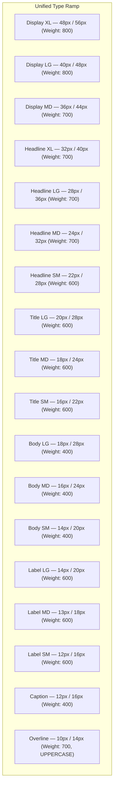

# 🎨 Sofiya Bangles — UI/UX Design System & Typography Constitution

> **Document Version**: 2.1.0  
> **Target Audience**: UI/UX Designers, Frontend Engineers, Mobile Engineers, AI Design Agents  
> **Status**: Single Source of Truth for Visual Design Decisions  
> **Last Verified Against Codebase**: September 2026  

---

## 📑 Table of Contents
1. [Design North Star](#-design-north-star)
2. [Color System & Semantic Tokens](#-color-system--semantic-tokens)
   - [Brand Primary: Sofiya Rose Palette](#1-brand-primary-sofiya-rose-palette)
   - [Secondary: Sapphire & Indigo Accents](#2-secondary-sapphire--indigo-accents)
   - [Jewelry Accents: Gold & Terracotta](#3-jewelry-accents-gold--terracotta)
   - [Surface & Neutral Scale](#4-surface--neutral-scale)
   - [Semantic Status Colors](#5-semantic-status-colors)
3. [Typography System & Type Ramp](#-typography-system--type-ramp)
   - [Font Families](#font-families)
   - [Standard Type Ramp (Web & Mobile)](#standard-type-ramp-web--mobile)
4. [8pt / 4pt Spacing & Layout Grid](#-8pt--4pt-spacing--layout-grid)
5. [Container Constraints & Responsive Breakpoints](#-container-constraints--responsive-breakpoints)
6. [Component Design Standards](#-component-design-standards)
   - [Buttons & Interactive Targets](#1-buttons--interactive-targets)
   - [Input Fields & Form States](#2-input-fields--form-states)
   - [Cards & Media Ratios](#3-cards--media-ratios)
   - [Empty, Loading & Error States](#4-empty-loading--error-states)
7. [Touch Ergonomics & Hit Targets](#-touch-ergonomics--hit-targets)
8. [Iconography & Media Principles](#-iconography--media-principles)
9. [Accessibility (a11y) & Ergonomics Matrix](#-accessibility-a11y--ergonomics-matrix)

---

## 🌟 Design North Star

Every screen across **Sofiya Bangles** (Customer Mobile App and Web Admin Portal) MUST strictly satisfy these foundational principles:

1. **Clarity before decoration**: Bangles and jewelry must be the visual hero; UI chrome should be elegant, refined, and unobtrusive.
2. **Hierarchy before density**: Never overwhelm the shopper or cashier with competing visual weights.
3. **Consistency before novelty**: Reusable design tokens govern all margins, radius, shadows, and typography.
4. **Touch & Pointer Ergonomics**: Strict compliance with $44 \times 44\text{ pt}$ touch targets (`space-11`) on mobile to ensure comfortable one-handed navigation.
5. **Universal Accessibility**: WCAG 2.2 AA compliant contrast, screen reader compatibility, and reduced-motion support.

---

## 🎨 Color System & Semantic Tokens

The color architecture is synchronized across [`web/src/theme/tokens.ts`](file:///c:/Local%20Disk%20D_8252026651/startUp/sofiya_bangles/web/src/theme/tokens.ts) and [`mobile/src/theme/tokens.ts`](file:///c:/Local%20Disk%20D_8252026651/startUp/sofiya_bangles/mobile/src/theme/tokens.ts):

### 1. Brand Primary: Sofiya Rose Palette
*Represents elegance, femininity, and bridal heritage.*

| Token | Web Hex | Mobile Hex | CSS Variable | Semantic Role |
| :--- | :--- | :--- | :--- | :--- |
| `primary-50` | `#FFF0F3` | `#FFF0F3` | `--color-primary-50` | Soft blush tint, OTP active background, card highlights |
| `primary-100`| `#FFD6DE` | `#FFD6DE` | `--color-primary-100`| Light blush badge backgrounds, subtle borders |
| `primary-200`| `#FFB3C2` | — | `--color-primary-200`| Gradient stops, pill hover states |
| `primary-300`| `#FF8099` | — | `--color-primary-300`| Shimmer highlights, gradient text |
| `primary-400`| `#FF4D70` | — | `--color-primary-400`| Accent strokes, secondary button borders |
| **`primary-500`**| **`#E8436E`** | **`#e11d48`** | `--color-primary-500` | **Primary Brand Color**: Primary CTAs, active tab icons |
| `primary-600`| `#CC3366` | `#be123c` | `--color-primary-600` | CTA hover state, active button gradients |
| `primary-700`| `#B3245A` | — | `--color-primary-700` | Pressed button state, deep rose accents |
| `primary-800`| `#991A4D` | — | `--color-primary-800` | Deep burgundy brand borders |
| `primary-900`| `#7A0D3C` | — | `--color-primary-900` | High-contrast brand headers |

### 2. Secondary: Sapphire & Indigo Accents
*Represents trust, analytics precision, and platform balance.*

| Token | Web Hex | Mobile Hex | CSS Variable | Semantic Role |
| :--- | :--- | :--- | :--- | :--- |
| `secondary-50` | `#F0F7FF` | `#e0e7ff` | `--color-secondary-50` | Table row hover, info backgrounds |
| `secondary-100`| `#DBECFF` | — | `--color-secondary-100`| Info badge backgrounds |
| `secondary-300`| `#85B8FF` | — | `--color-secondary-300`| Chart accent lines |
| **`secondary-500`**| **`#2563EB`** | **`#6366f1`** | `--color-secondary-500` | **Secondary Brand**: Analytics, links, admin actions |
| `secondary-600`| `#1D4ED8` | — | `--color-secondary-600` | Link hover states, primary chart bars |
| `secondary-700`| `#1E40AF` | — | `--color-secondary-700` | Deep blue table headers |

### 3. Jewelry Accents: Gold & Terracotta

| Token | Hex Value | Application |
| :--- | :--- | :--- |
| `accent.gold` | `#D4AF37` | **Bangle Gold Accent**: Rating stars, premium bridal badges, special ID code tags |
| `text.price` | `#C25B3E` | **Terracotta Warm Price**: Product pricing displays for maximum visual warmth |
| `accent.orange` | `#EA580C` | Web promotional tags, discount badges |

### 4. Surface & Neutral Scale

| Token | Web Hex | Mobile Hex | Semantic Role |
| :--- | :--- | :--- | :--- |
| `surface.bg` | `#FAFAFA` | `#F8FAFC` | Main canvas background |
| `surface.card` | `#FFFFFF` | `#FFFFFF` | Card containers, modals, bottom sheets |
| `surface.muted` | `#F1F5F9` | `#F1F5F9` | Table headers, secondary search inputs |
| `text.primary` | `#0F172A` | `#0F172A` | Slate-900: High-contrast headings and body text |
| `text.secondary`| `#475569` | `#64748B` | Slate-600/500: Subtitles, metadata, timestamps |
| `text.muted` | `#64748B` | `#94A3B8` | Slate-500/400: Placeholders, disabled text |
| `border.default`| `#E2E8F0` | `#F1F5F9` | Default card and divider borders |
| `border.strong` | `#CBD5E1` | `#CBD5E1` | Input focus outlines, table borders |

### 5. Semantic Status Colors

| State | Background | Text Color | Border Color | Dot Indicator |
| :--- | :--- | :--- | :--- | :--- |
| **Success** | `#ECFDF5` | `#047857` | `#A7F3D0` | `#10B981` (Emerald) |
| **Warning** | `#FFFBEB` | `#B45309` | `#FDE68A` | `#F59E0B` (Amber) |
| **Danger / Error** | `#FEF2F2` | `#B91C1C` | `#FECACA` | `#EF4444` (Rose Red) |
| **Info** | `#EFF6FF` | `#1D4ED8` | `#BFDBFE` | `#3B82F6` (Blue) |

---

## ✍️ Typography System & Type Ramp

### Font Families
* **Web Editorial Headings**: `'Playfair Display', Georgia, serif` (Evoking timeless luxury jewelry).
* **Web & Mobile Body**: `'Inter', system-ui, -apple-system, sans-serif` (Crisp digital legibility).
* **Web Monospace / Codes**: `'Fira Code', 'Courier New', monospace` (For special product codes e.g. `PRD-GLD-0042`).

### Standard Type Ramp (Web & Mobile)



| Type Token | Font Size | Line Height | Letter Spacing | Weight | Typical Usage |
| :--- | :--- | :--- | :--- | :--- | :--- |
| `display-xl` | `3rem` (48px) | `3.5rem` (56px) | `-0.025em` | 800 (Bold) | Marketing hero banners, splash screens |
| `display-lg` | `2.5rem` (40px)| `3rem` (48px) | `-0.025em` | 800 (Bold) | Category showcase headers |
| `display-md` | `2.25rem` (36px)| `2.75rem` (44px)| `-0.02em` | 700 (Bold) | Section hero headers |
| `headline-xl`| `2rem` (32px) | `2.5rem` (40px) | `-0.02em` | 700 (Bold) | Main screen titles, modal headers |
| `headline-lg`| `1.75rem` (28px)| `2.25rem` (36px)| `-0.015em`| 700 (Bold) | Screen titles on mobile |
| `headline-md`| `1.5rem` (24px) | `2rem` (32px) | `-0.015em`| 700 (Bold) | Dashboard KPI card titles |
| `headline-sm`| `1.375rem` (22px)| `1.75rem` (28px)| `-0.01em` | 600 (SemiBold)| Card group headers |
| `title-lg` | `1.25rem` (20px)| `1.75rem` (28px)| `-0.01em` | 600 (SemiBold)| Product detail page titles |
| `title-md` | `1.125rem` (18px)| `1.5rem` (24px) | `-0.005em`| 600 (SemiBold)| Product card titles |
| `title-sm` | `1rem` (16px) | `1.375rem` (22px)| `0em` | 600 (SemiBold)| Sub-section titles |
| `body-lg` | `1.125rem` (18px)| `1.75rem` (28px)| `0em` | 400 (Regular) | Lead introductory paragraphs |
| `body-md` | `1rem` (16px) | `1.5rem` (24px) | `0em` | 400 (Regular) | Default body copy, descriptions |
| `body-sm` | `0.875rem` (14px)| `1.25rem` (20px)| `0em` | 400 (Regular) | Sizing notes, address items |
| `label-lg` | `0.875rem` (14px)| `1.25rem` (20px)| `0.01em` | 600 (SemiBold)| Primary button labels |
| `label-md` | `0.8125rem` (13px)| `1.125rem` (18px)| `0.01em` | 600 (SemiBold)| Input labels, filter chips |
| `label-sm` | `0.75rem` (12px)| `1rem` (16px) | `0.02em` | 600 (SemiBold)| Size pill tags, stock status badges |
| `caption` | `0.75rem` (12px)| `1rem` (16px) | `0.02em` | 400 (Regular) | Helper text, timestamps |
| `overline` | `0.6875rem` (11px)| `0.875rem` (14px)| `0.06em` | 700 (Bold) | Uppercase category tags |

---

## 📏 8pt / 4pt Spacing & Layout Grid

All layout dimensions MUST use the $8\text{pt} / 4\text{pt}$ scale:

| Spacing Token | Web Rem / Pixels | Mobile Native | Semantic Application |
| :--- | :--- | :--- | :--- |
| `space-0` | `0px` | `0` | Reset / zero spacing |
| `space-1` | `0.25rem` (4px) | `4` | Micro spacing: icon-to-label gap |
| `space-2` | `0.5rem` (8px) | `8` | Tight spacing: between label and input |
| `space-3` | `0.75rem` (12px)| `12` | Compact padding: internal card padding |
| `space-4` | `1rem` (16px) | `16` | **Standard Gutter**: Screen edge margin, list spacing |
| `space-5` | `1.25rem` (20px)| `20` | Medium gap: between form sections |
| `space-6` | `1.5rem` (24px) | `24` | Section spacing: grid gaps |
| `space-8` | `2rem` (32px) | `32` | Major section break |
| `space-10`| `2.5rem` (40px) | `40` | Large section divider |
| **`space-11`**| **`2.75rem` (44px)**| **`44`** | **Minimum Touch Target Boundary** |
| `space-12`| `3rem` (48px) | `48` | Modal header-to-content padding |
| `space-16`| `4rem` (64px) | `64` | Hero top/bottom margins |

---

## 📐 Container Constraints & Responsive Breakpoints

| Viewport Size | Width Range | Layout Strategy |
| :--- | :--- | :--- |
| **Mobile (`sm`)** | $< 640\text{px}$ | Single column, sticky bottom navigation, full-width modal sheets |
| **Tablet (`md`)** | $640\text{px} - 1023\text{px}$ | 2-3 column product grid, collapsible navigation rail |
| **Desktop (`lg`)** | $1024\text{px} - 1279\text{px}$ | Persistent sidebar, 4-column product grid, top action bar |
| **Wide (`xl`)** | $\ge 1280\text{px}$ | Constrained $1440\text{px}$ centered container (`max-w-[1440px] mx-auto`) |

---

## 🧩 Component Design Standards

### 1. Buttons & Interactive Targets
* **Touch Target**: Strict minimum $44 \times 44\text{ pt}$ on mobile; minimum $36\text{px}$ height on web.
* **Hierarchy**:
  * **Primary**: `gradient-primary` (`#E8436E` $\rightarrow$ `#CC3366` $\rightarrow$ `#B3245A`) with white text.
  * **Secondary**: Outlined stroke (`border: 1px solid #E2E8F0`, hover: `#E8436E`).
  * **Destructive**: Ruby Red (`#FEF2F2` bg, `#B91C1C` text, `#FECACA` border).
  * **Icon Button**: Enclosed in a $44 \times 44\text{ pt}$ hit box with `hitSlop: 10`.

### 2. Input Fields & Form States
* **OTP Input**: Dedicated $48 \times 56\text{px}$ digit boxes with `border: 2px solid #E2E8F0`. On focus: `border-color: #E8436E`, `box-shadow: 0 0 0 3px rgba(232, 67, 110, 0.15)`. Filled state: `#FFF0F3` background.
* **Text Inputs**: Visible floating label $\rightarrow$ input box $\rightarrow$ helper text/error state.

### 3. Cards & Media Ratios
* **Product Cards**: Aspect ratio **1:1** (Square) for symmetrical bangle photography.
* **Border Radius**:
  * Buttons & Inputs: `rounded-lg` ($12\text{px}$) on mobile, `rounded-md` ($8\text{px}$) on web.
  * Cards: `rounded-xl` ($16\text{px}$ on mobile, $12\text{px}$ on web).
  * Modal Sheets: `rounded-2xl` ($24\text{px}$).

### 4. Empty, Loading & Error States
* **Empty State**: Displays an illustrative vector, clear explanation, and primary action button.
* **Loading State**: Shimmer animation (`background: linear-gradient(...)`) preserving card geometry.
* **Error State**: Actionable card with retry button and direct error bus reporting.

---

## 📱 Touch Ergonomics & Hit Targets

From [`mobile/src/theme/tokens.ts`](file:///c:/Local%20Disk%20D_8252026651/startUp/sofiya_bangles/mobile/src/theme/tokens.ts#L118-L123):
```typescript
export const touchTargets = {
  minWidth: 44,
  minHeight: 44,
  hitSlop: { top: 10, bottom: 10, left: 10, right: 10 },
  largeHitSlop: { top: 14, bottom: 14, left: 14, right: 14 },
} as const;
```
All interactive elements (buttons, navigation tabs, back arrows, favorite hearts) must apply `touchTargets.hitSlop` to ensure comfortable one-handed thumb interaction.

---

## 💎 Iconography & Media Principles

* **Unified Family**: Exclusively use **Lucide Icons** (`lucide-react` on web, Lucide native SVGs on mobile).
* **Stroke Width**: Standardized $2\text{px}$ stroke width across all screen densities.
* **Accessible Labels**: All icon-only buttons must have `aria-label` (web) or `accessibilityLabel` (mobile).

---

## ♿ Accessibility (a11y) & Ergonomics Matrix

| Accessibility Area | Standard | Implementation Rule |
| :--- | :--- | :--- |
| **Color Contrast** | WCAG 2.2 AA | Normal text $\ge 4.5:1$; Large text $\ge 3:1$; UI controls $\ge 3:1$. |
| **Touch Ergonomics** | Apple HIG / Material | Minimum interactive hit area $44 \times 44\text{ pt}$ (`space-11`). |
| **Keyboard Navigation** | WAI-ARIA 1.2 | Full tab traversal, Enter/Space activation, Escape to dismiss modals. |
| **Screen Readers** | VoiceOver / TalkBack | Semantic HTML (`<main>`, `<nav>`, `<button>`) + meaningful labels. |
| **Motion Sensitivity** | `prefers-reduced-motion` | Disable decorative transitions and spring animations when active. |
