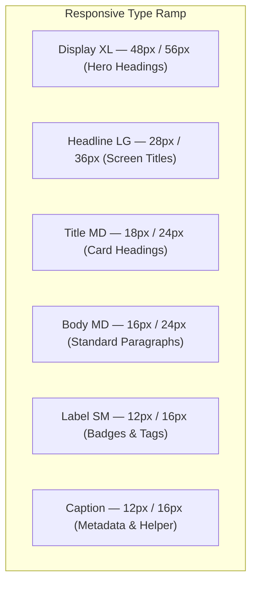
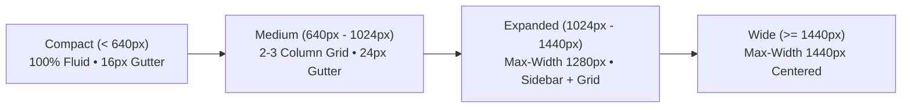

# 🎨 Sofiya Bangles — UI/UX Design System & Typography Constitution

> **Document Version**: 2.0.0  
> **Target Audience**: UI/UX Designers, Frontend Engineers, Mobile Engineers, AI Design Agents  
> **Status**: Mandatory Living Design System  
> **Last Updated**: September 2026  

---

## 📑 Table of Contents
1. [Design North Star](#-design-north-star)
2. [Color Palette & Semantic Tokens](#-color-palette--semantic-tokens)
   - [Theme A: Light (Ivory & Royal Gold)](#1-theme-a-light-ivory--royal-gold)
   - [Theme B: Dark (Onyx & Champagne Gold)](#2-theme-b-dark-onyx--champagne-gold)
   - [Theme C: High Contrast & Accessibility](#3-theme-c-high-contrast--accessibility)
3. [Typography System & Type Ramp](#-typography-system--type-ramp)
4. [8pt / 4pt Spacing & Layout Grid](#-8pt--4pt-spacing--layout-grid)
5. [Container Constraints & Responsive Breakpoints](#-container-constraints--responsive-breakpoints)
6. [Component Design Standards](#-component-design-standards)
   - [Buttons & Interactive Targets](#1-buttons--interactive-targets)
   - [Input Fields & Form States](#2-input-fields--form-states)
   - [Cards & Media Ratios](#3-cards--media-ratios)
   - [Empty, Loading & Error States](#4-empty-loading--error-states)
7. [Iconography & Media Principles](#-iconography--media-principles)
8. [Accessibility (a11y) & Ergonomics Matrix](#-accessibility-a11y--ergonomics-matrix)

---

## 🌟 Design North Star

Every screen across **Sofiya Bangles** (Mobile App and Web Portal) MUST satisfy these core principles:

1. **Clarity before decoration**: Bangles and jewelry must be the visual hero; UI chrome should be elegant, refined, and unobtrusive.
2. **Hierarchy before density**: Never overwhelm the shopper or cashier with competing visual weights.
3. **Consistency before novelty**: Reusable design tokens govern all margins, radius, shadows, and typography.
4. **Touch & Pointer Ergonomics**: Strict compliance with $44 \times 44\text{ pt}$ touch targets on mobile to ensure comfortable one-handed navigation.
5. **Universal Accessibility**: WCAG 2.2 AA compliant contrast, screen reader compatibility, and reduced-motion support.

---

## 🎨 Color Palette & Semantic Tokens

The color system transitions from raw primitives to semantic roles, ensuring consistent theme propagation:

```
Primitive Colors (e.g. Gold-500)  ──▶  Semantic Roles (e.g. brand-primary)  ──▶  Component Tokens (e.g. button-cta-bg)
```

### 1. Theme A: Light (Ivory & Royal Gold)
*Primary daytime retail experience evoking luxury, purity, and South Asian bridal heritage.*

| Token Name | Hex Value | Semantic Purpose |
| :--- | :--- | :--- |
| `--color-brand-primary` | `#D4AF37` | Royal Gold: Primary CTAs, active highlights, badges |
| `--color-brand-secondary`| `#B8860B` | Dark Goldenrod: Borders, hover states, accents |
| `--color-bg-primary` | `#FDFBF7` | Warm Ivory: Primary page canvas |
| `--color-bg-surface` | `#FFFFFF` | Pure White: Card containers, dialogs, dropdowns |
| `--color-text-primary` | `#1A1815` | Deep Charcoal: Main headings and body text |
| `--color-text-muted` | `#6B665E` | Warm Grey: Subtitles, metadata, captions |
| `--color-border-subtle` | `#E8E2D5` | Soft Warm Border: Dividers, card strokes |

### 2. Theme B: Dark (Onyx & Champagne Gold)
*Refined evening ambiance with layered dark surfaces to prevent eye fatigue while preserving gold brilliance.*

| Token Name | Hex Value | Semantic Purpose |
| :--- | :--- | :--- |
| `--color-brand-primary` | `#E5C158` | Champagne Gold: High-contrast golden highlights |
| `--color-bg-primary` | `#121212` | Deep Onyx: Base canvas (never pure #000000) |
| `--color-bg-surface` | `#1E1E1E` | Layered Charcoal: Elevated cards and sheets |
| `--color-text-primary` | `#F7F5F0` | Off-White: High legibility text |
| `--color-text-muted` | `#9E988D` | Muted Khaki Grey: Supporting copy |
| `--color-border-subtle` | `#2D2B27` | Subtle border stroke for surface separation |

### 3. Theme C: High Contrast & Accessibility
*High-visibility mode for outdoor brightness or visual impairments.*
* **Canvas**: Pure Black (`#000000`) / Pure White (`#FFFFFF`).
* **Borders**: High-visibility $2\text{px}$ solid strokes (`#FFFFFF` in dark, `#000000` in light).
* **Text Contrast**: Exceeds $7:1$ contrast ratio (WCAG AAA).

---

## ✍️ Typography System & Type Ramp

The type system is anchored in **Outfit** (display headings) and **Inter** (body, numerals, and data).



| Type Token | Font Size | Line Height | Font Weight | Typical Application |
| :--- | :--- | :--- | :--- | :--- |
| `display-xl` | $48\text{px}$ | $56\text{px}$ | Bold (700) | Home hero banners, promotional splash |
| `headline-lg`| $28\text{px}$ | $36\text{px}$ | SemiBold (600) | Screen titles, Category headers |
| `title-lg` | $20\text{px}$ | $28\text{px}$ | SemiBold (600) | Modal headers, product detail title |
| `title-md` | $18\text{px}$ | $24\text{px}$ | Medium (500) | Product card titles, Section headers |
| `body-lg` | $18\text{px}$ | $28\text{px}$ | Regular (400) | Lead introductory paragraphs |
| `body-md` | $16\text{px}$ | $24\text{px}$ | Regular (400) | Default body text, descriptions |
| `body-sm` | $14\text{px}$ | $20\text{px}$ | Regular (400) | Sizing notes, address items |
| `label-md` | $13\text{px}$ | $18\text{px}$ | SemiBold (600) | Button text, form field labels |
| `label-sm` | $12\text{px}$ | $16\text{px}$ | Medium (500) | Stock badges, size tag pills |
| `caption` | $12\text{px}$ | $16\text{px}$ | Regular (400) | Timestamps, audit logs, disclaimer |

---

## 📏 8pt / 4pt Spacing & Layout Grid

All padding, margin, and gap values MUST be derived from the $8\text{pt}$ / $4\text{pt}$ scale:

$$\text{Spacing}(n) = n \times 4\text{px}$$

| Token | Pixels | Application |
| :--- | :--- | :--- |
| `space-1` | $4\text{px}$ | Micro spacing: icon-to-text gap, badge inner padding |
| `space-2` | $8\text{px}$ | Tight spacing: between form label and input |
| `space-3` | $12\text{px}$| Compact spacing: card internal padding on mobile |
| `space-4` | $16\text{px}$| Default gutter: screen horizontal edge padding, list gaps |
| `space-6` | $24\text{px}$| Section spacing: gap between product grid and banner |
| `space-8` | $32\text{px}$| Major section dividers: header to main content |
| `space-12`| $48\text{px}$| Hero padding: desktop banner top/bottom margins |

---

## 📐 Container Constraints & Responsive Breakpoints

Content should never stretch unconstrained across ultra-wide monitors.



| Breakpoint | Width Range | Layout Behavior |
| :--- | :--- | :--- |
| **Mobile (`sm`)** | $< 640\text{px}$ | Single column, bottom navigation bar, full-width sheets |
| **Tablet (`md`)** | $640\text{px} - 1023\text{px}$ | 2-3 column product grid, navigation rail or collapsible header |
| **Desktop (`lg`)** | $1024\text{px} - 1279\text{px}$ | Persistent sidebar, 4-column product grid, top utility bar |
| **Wide (`xl`)** | $\ge 1280\text{px}$ | Constrained $1440\text{px}$ centered container with multi-pane layout |

---

## 🧩 Component Design Standards

### 1. Buttons & Interactive Targets
* **Touch Target**: Minimum $44 \times 44\text{ pt}$ on mobile; $36\text{px}$ height on desktop.
* **Hierarchy**:
  * **Primary**: Filled Royal Gold (`#D4AF37`) with dark text (`#1A1815`) for high legibility.
  * **Secondary**: Outlined warm stroke (`#D4AF37`) with transparent background.
  * **Destructive**: Ruby Red (`#E11D48`) for delete and discard actions.
* **States**: `default`, `hover`, `active`, `focused` (visible $2\text{px}$ focus ring), `disabled` (40% opacity), `loading` (spinner replacing label, prevents double submit).

### 2. Input Fields & Form States
* **Structure**: Mandatory visible Label $\rightarrow$ Input field $\rightarrow$ Helper text / Error message.
* **States**: `default`, `focus` (gold border + glow), `error` (crimson border + error icon), `disabled`.
* **Never use placeholder as the sole label.**

### 3. Cards & Media Ratios
* **Aspect Ratios**:
  * Product Thumbnails: **1:1** (Square) for bangles symmetry.
  * Hero Banners: **16:9** on desktop, **4:3** on mobile.
* **Visual Treatment**: Subtle border (`1px solid #E8E2D5`) + gentle shadow (`0 2px 8px rgba(0,0,0,0.04)`). Never combine heavy dark shadows with thick borders.

### 4. Empty, Loading & Error States
* **Empty State**: Must state (1) What is missing, (2) Why it is empty, and (3) Actionable CTA button (e.g. "Explore Bridal Collection").
* **Loading State**: Shimmer skeletons matching the card geometry to eliminate Cumulative Layout Shift (CLS).
* **Error State**: Actionable explanation with "Retry" button. Never display raw HTTP `500` or database exceptions.

---

## 💎 Iconography & Media Principles

* **Icon Family**: Exclusively use **Lucide Icons** (Web: `lucide-react`, Mobile: Lucide native SVG components).
* **Consistency**: $2\text{px}$ stroke width, rounded caps and joins.
* **Accessibility**: Every icon button must have an `aria-label` (web) or `accessibilityLabel` (mobile).

---

## ♿ Accessibility (a11y) & Ergonomics Matrix

| Accessibility Area | Standard | Implementation Rule |
| :--- | :--- | :--- |
| **Color Contrast** | WCAG 2.2 AA | Normal text $\ge 4.5:1$; Large text $\ge 3:1$; UI controls $\ge 3:1$. |
| **Touch Ergonomics** | Apple HIG / Material | Minimum interactive hit area $44 \times 44\text{ pt}$ on mobile devices. |
| **Keyboard Navigation** | WAI-ARIA 1.2 | Full tab traversal, Enter/Space activation, Escape to close modals. |
| **Screen Readers** | VoiceOver / TalkBack | Semantic HTML (`<main>`, `<nav>`, `<button>`) + meaningful labels. |
| **Motion Sensitivity** | `prefers-reduced-motion` | Disable decorative transitions and spring animations when active. |
