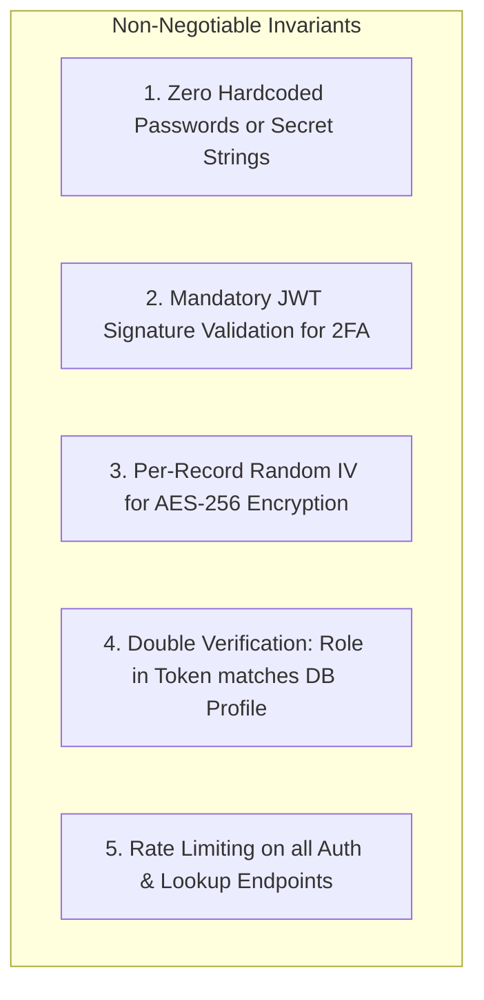

# 🧠 Sofiya Bangles — Agent Memory & Context Anchor

> **Document Version**: 2.0.0  
> **Target Audience**: AI Agents (Antigravity), Core Maintainers, Onboarding Developers  
> **Status**: Living Knowledge Base & Immutable Decision Log  
> **Last Updated**: September 2026  

---

## 📌 Agent Directive: Read First Before Acting!
> [!IMPORTANT]
> **To all future AI Coding Assistants & Developers**:  
> Before modifying any source code, database queries, authentication flows, or workflows in this repository, you **MUST** read and respect the decisions, patterns, and constraints documented below. Never revert, bypass, or guess these architectural anchors.

---

## 📑 Table of Contents
1. [Project Snapshot & Repository Map](#-project-snapshot--repository-map)
2. [Architectural Decision Records (ADRs)](#-architectural-decision-records-adrs)
3. [Critical Security Invariants](#-critical-security-invariants)
4. [Known Gotchas & Solutions Log](#-known-gotchas--solutions-log)
5. [Active Git Branches & CI/CD Pipeline Context](#-active-git-branches--cicd-pipeline-context)
6. [Forbidden Anti-Patterns (The "Never Do" List)](#-forbidden-anti-patterns-the-never-do-list)

---

## 🗺️ Project Snapshot & Repository Map

| Application | Path | Tech Stack | Port | Purpose |
| :--- | :--- | :--- | :--- | :--- |
| **Backend API** | `backend/` | Node.js, Express 5, TypeScript, Firestore, Supabase Postgres | `5000` | Central REST API, Auth, 2FA, Business Logic |
| **Web Admin** | `web/` | Next.js 15 (App Router), React 19, TypeScript, TailwindCSS | `3000` | Store Manager & SuperAdmin Web Dashboard |
| **Mobile App** | `mobile/` | React Native, Expo SDK 54, NativeWind, Zustand | N/A | Customer Discovery, Sizing, Wishlist & Orders |

---

## 📜 Architectural Decision Records (ADRs)

### ADR-001: 2FA TOTP Cryptographic Architecture
* **Context**: Store Admins and Super Admins require hardware-backed 2FA without exposing plaintext secrets in database snapshots or audit logs.
* **Decision**: 
  1. Base32 TOTP secrets generated via `otplib` with dynamic monthly issuer (`Sofiya Bangles (MM/YYYY)`).
  2. Secrets encrypted at rest using **AES-256-CBC** with per-record random Initialization Vectors (`ivHex:encryptedHex`).
  3. Key derivation is strictly dynamic from `process.env.TOTP_ENCRYPTION_KEY` or `process.env.JWT_SECRET`. Zero hardcoded fallback strings.
  4. Verification uses a $\pm 60\text{s}$ tolerance window to absorb client device clock drift.

### ADR-002: Mandatory `otp_pending_token` (No Security Bypass)
* **Context**: CodeQL flagged **CWE-807 (User-controlled bypass of security check)** on line 255 of `totp.service.ts` because a user-supplied `bodyChallengeId` previously bypassed a failed JWT check.
* **Decision**:
  1. Every call to `/auth/verify-2fa` **must** provide a valid, signed `otp_pending_token`.
  2. If `jwt.verify` fails, the request is rejected immediately with `401 Unauthorized`.
  3. If `bodyChallengeId` is provided, it must strictly match `decoded.challengeId`.

### ADR-003: Universal Storage Bridge in Mobile
* **Context**: Expo's `expo-secure-store` throws `ExpoSecureStore.default.getValueWithKeyAsync is not a function` when running in browser/web environments.
* **Decision**: Created [`mobile/src/utils/secureStore.ts`](file:///c:/Local%20Disk%20D_8252026651/startUp/sofiya_bangles/mobile/src/utils/secureStore.ts) which dynamically checks `Platform.OS === 'web'`. Uses native `ExpoSecureStore` on iOS/Android and safe `window.localStorage` with SSR guards on web.

### ADR-004: Docker Buildx Isolated Cache Scopes
* **Context**: Parallel builds of `build-backend-docker` and `build-web-docker` failed in GitHub Actions with `error writing layer blob: not_found` due to shared `cache-to: type=gha,mode=max`.
* **Decision**: Updated [`.github/workflows/docker.yml`](file:///c:/Local%20Disk%20D_8252026651/startUp/sofiya_bangles/.github/workflows/docker.yml) to use isolated scopes (`scope=backend`, `scope=web`) and `mode=min` (caching final layers only).

### ADR-005: Trivy Scanner Tag Resolution
* **Context**: GitHub Actions failed after 2s on `aquasecurity/trivy-action@0.28.0` because Aqua Security migrated all tags to require the `v` prefix.
* **Decision**: Pinned action to `aquasecurity/trivy-action@v0.36.0` with `exit-code: '0'` and SARIF upload to GitHub Security tab.

### ADR-006: Mobile `tsconfig.json` Configuration
* **Context**: Writing `"extends": "expo/tsconfig.base.json"` breaks TypeScript module resolution.
* **Decision**: Must extend `"expo/tsconfig.base"` and include `"baseUrl": "."` so that path aliases (`"@/*": ["./*"]`) resolve cleanly across both IDE and CLI.

---

## 🛡️ Critical Security Invariants

---

## ⚡ Known Gotchas & Solutions Log

| Symptom / Error | Root Cause | Exact Solution |
| :--- | :--- | :--- |
| `ExpoSecureStore.default... is not a function` | Running Expo app in web mode | Always import storage from `@/src/utils/secureStore` instead of directly from `expo-secure-store`. |
| `Cannot find base config file 'expo/tsconfig.base.json'` | TypeScript automatically appends `.json` to npm extends | Set `"extends": "expo/tsconfig.base"` in `mobile/tsconfig.json`. |
| `Option 'paths' cannot be used without '--baseUrl'` | TS compiler requires baseUrl when paths are defined | Set `"baseUrl": "."` in `compilerOptions` in `mobile/tsconfig.json`. |
| `error writing layer blob: not_found` in Docker GHA | GHA cache eviction caused by parallel un-scoped writes | Use `cache-to: type=gha,mode=min,scope=<app>` in `.github/workflows/docker.yml`. |
| `Unable to resolve action aquasecurity/trivy-action@0.28.0` | Aqua Security tag migration in 2026 | Use `aquasecurity/trivy-action@v0.36.0` (mandatory `v` prefix). |
| `User-controlled bypass of security check (CodeQL)` | Catching JWT error and allowing user-provided fallback | Require `otp_pending_token` and throw on verification error without bypass. |

---

## 🌿 Active Git Branches & CI/CD Pipeline Context

* **`main`**: Production deployment branch (protected; requires PR, branch review, and all CI checks green).
* **`feature-development`**: Main integration branch where all active PRs and feature branches merge before release.
* **Active PR**: PR #2 (`feature-development` $\rightarrow$ `main`).
* **Automated CI Workflows**:
  1. `Main CI/CD Pipeline` (`.github/workflows/main-ci.yml`) — Typechecks, linting, tests.
  2. `Security Scanning & Audits` (`.github/workflows/security.yml`) — CodeQL SAST, Trivy, Gitleaks.
  3. `Docker Build & Verification` (`.github/workflows/docker.yml`) — Compose validation, Buildx container builds.

---

## 🚫 Forbidden Anti-Patterns (The "Never Do" List)

1. **NEVER** write a fallback password or secret string in source code (e.g. `const pass = process.env.PASS || "DefaultPass123"`). Use `crypto.randomBytes(16).toString("hex")` or throw if missing.
2. **NEVER** use `any` when defining API requests, responses, or database entities.
3. **NEVER** make direct Firestore or PostgreSQL queries inside Express route controllers.
4. **NEVER** use inline styles in React components when equivalent design tokens exist in `tailwind.config` or `tokens.ts`.
5. **NEVER** commit changes without running `npx tsc --noEmit` across `backend`, `web`, and `mobile`.
