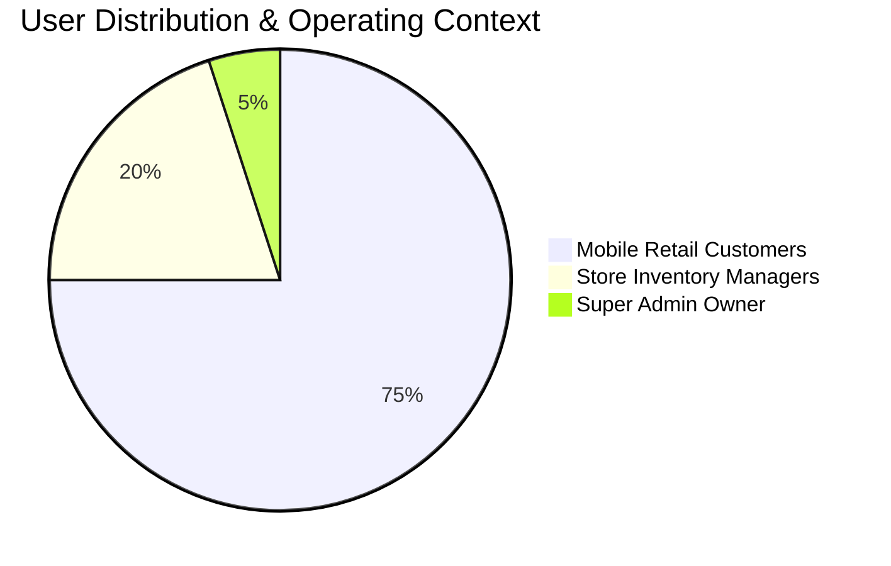
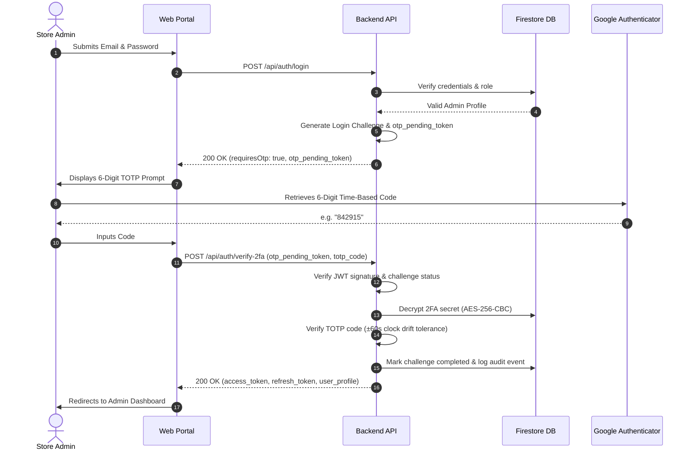
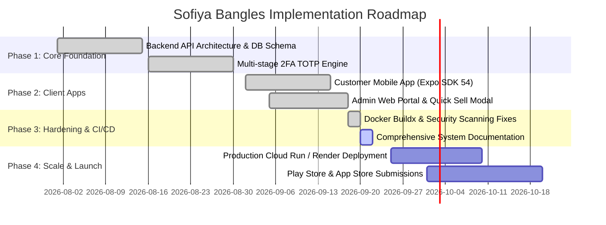

# 💍 Sofiya Bangles — Product Requirements Document (PRD)

> **Document Version**: 2.0.0  
> **Target Audience**: Product Managers, Software Engineers, UI/UX Designers, QA Engineers, DevOps  
> **Status**: Approved & In Active Implementation  
> **Last Updated**: September 2026  

---

## 📑 Table of Contents
1. [Executive Summary](#-executive-summary)
2. [Product Vision & Objectives](#-product-vision--objectives)
3. [User Personas & Target Demographics](#-user-personas--target-demographics)
4. [Functional Requirements (Feature Specifications)](#-functional-requirements-feature-specifications)
   - [Customer Mobile Experience (Expo / React Native)](#1-customer-mobile-experience)
   - [Store Admin & Super Admin Web Portal (Next.js 15)](#2-store-admin--super-admin-web-portal)
   - [Backend Core Services (Express 5 / Node.js)](#3-backend-core-services)
5. [Non-Functional Requirements (NFRs)](#-non-functional-requirements-nfrs)
6. [Security & Compliance Matrix](#-security--compliance-matrix)
7. [User Journey & Sequence Workflows](#-user-journey--sequence-workflows)
8. [Release Phases & Milestone Roadmap](#-release-phases--milestone-roadmap)

---

## 🌟 Executive Summary

**Sofiya Bangles** is an omnichannel e-commerce and inventory orchestration platform specialized in handcrafted, bridal, gold-plated, glass, and designer bangles. The platform bridges the gap between traditional artisanal jewelry retail and modern digital commerce through three tightly integrated applications:

1. **Customer Mobile App** (`mobile/`): A high-performance React Native (Expo SDK 54) mobile app enabling customers to discover bangles by model type, preview variants, submit custom sizing preferences, manage wishlists, and order seamlessly via direct checkout or instant WhatsApp inquiry.
2. **Store Management Portal** (`web/`): A modern Next.js 15 App Router web application empowering store managers and the super administrator to manage products, categories, dynamic commission splits (70/30), offline POS "Quick Sell" transactions, and deep financial analytics.
3. **Core API Engine** (`backend/`): A resilient Express 5 / TypeScript backend managing distributed data persistence across Google Cloud Firestore and Supabase PostgreSQL, backed by Cloudinary CDN and multi-stage 2FA TOTP authentication.

---

## 🎯 Product Vision & Objectives

### Vision Statement
*"To deliver the premier digital destination for handcrafted bangles, celebrating South Asian craftsmanship while providing uncompromising digital convenience, custom sizing precision, and enterprise-grade security."*

### Key Performance Indicators (KPIs)
* **Conversion Rate**: $\ge 4.5\%$ on mobile discovery-to-checkout flows.
* **Order Sizing Accuracy**: $> 99\%$ sizing satisfaction using the digital Bangle Sizing Guide and Custom Diameter Submission.
* **Admin Efficiency**: $< 10\text{ seconds}$ to execute an in-store "Quick Sell" transaction by barcode or special product ID.
* **System Uptime & Latency**: $99.95\%$ API availability with $p95 \le 200\text{ms}$ on catalogue queries.
* **Zero Trust Security**: $100\%$ 2FA enforcement for administrative roles with zero plaintext secret persistence.

---

## 👥 User Personas & Target Demographics

### 1. The Shopper (Amina, 28)
* **Profile**: Working professional and bride-to-be shopping for wedding sets and daily wear.
* **Pain Points**: Traditional sizing charts are confusing; bangles often arrive too loose or too tight; concerns over authentic materials.
* **Needs**: Visual high-res zoom, clear sizing guide (2-4, 2-6, 2-8), instant WhatsApp inquiry for custom bridal sets, and frictionless mobile ordering.

### 2. The Store Admin (Farooq, 42)
* **Profile**: In-store retail manager managing thousands of bangle SKUs and daily footfall.
* **Pain Points**: Updating stock manually while handling walk-in customers leads to stock discrepancies.
* **Needs**: Fast "Quick Sell" modal to scan/type a special product code (`PRD-GLD-0042`), deduct stock immediately, and record customer details without full checkout overhead.

### 3. The Super Admin Owner (Sofiya, 50)
* **Profile**: Business founder overseeing store branches, revenue allocation, and security compliance.
* **Pain Points**: Unauthorized staff actions, tracking branch revenue splits, preventing data leaks.
* **Needs**: Hardware-backed TOTP 2FA, immutable audit logging, configurable commission splits (70% admin / 30% super-admin), and full revenue ledger visibility.

---

## ⚙️ Functional Requirements (Feature Specifications)

### 1. Customer Mobile Experience

| Feature ID | Feature Name | Description | Priority |
| :--- | :--- | :--- | :--- |
| **MOB-01** | **Dynamic Home Feed** | Curated hero banners, categorized model types (Bridal, Glass, Stone, Thread), trending carousels, and new arrivals. | `P0 (Critical)` |
| **MOB-02** | **Bangle Sizing Suite** | Interactive sizing selector (2-2, 2-4, 2-6, 2-8, 2-10) with visual millimeter diameter guide and custom size request input. | `P0 (Critical)` |
| **MOB-03** | **Instant Search & Filter** | Real-time debounced search by name, model type, category, and price range with instant tag toggling. | `P0 (Critical)` |
| **MOB-04** | **Wishlist & Favorites** | Offline-resilient favorites store (Zustand + AsyncStorage) synchronized with backend when authenticated. | `P1 (High)` |
| **MOB-05** | **WhatsApp Direct Order** | One-tap WhatsApp checkout pre-filling product SKU, selected size, and quantity directly to the store's business line. | `P0 (Critical)` |
| **MOB-06** | **In-App Orders Hub** | Real-time status tracker (Placed $\rightarrow$ Confirmed $\rightarrow$ Shipped $\rightarrow$ Delivered) with cancellation requests. | `P1 (High)` |
| **MOB-07** | **Customer Auth** | Passwordless phone OTP login and Google Sign-In with universal token persistence (`expo-secure-store` on native, safe `localStorage` on web). | `P0 (Critical)` |

### 2. Store Admin & Super Admin Web Portal

| Feature ID | Feature Name | Description | Priority |
| :--- | :--- | :--- | :--- |
| **WEB-01** | **Multi-Factor Auth (2FA)** | Mandatory Google Authenticator TOTP verification with encrypted secret storage and single-use backup recovery codes. | `P0 (Critical)` |
| **WEB-02** | **Quick Sell POS** | Dedicated cashier modal to look up products by code or barcode, input quantity sold, collect buyer info, and decrement inventory atomically. | `P0 (Critical)` |
| **WEB-03** | **Product Catalogue Manager** | Multi-image drag-and-drop Cloudinary upload, variants builder, model type assignment, and pricing controls. | `P0 (Critical)` |
| **WEB-04** | **Category & Model Types** | Hierarchical taxonomy management allowing categories to nest cleanly under specific jewelry model types. | `P1 (High)` |
| **WEB-05** | **Commission & Revenue Ledger** | Super-admin controlled platform commission settings (e.g. 70% branch / 30% parent) with automated allocation per completed sale. | `P0 (Critical)` |
| **WEB-06** | **Audit Log Inspection** | Read-only ledger capturing actor, action, timestamp, IP address, and before/after delta snapshots for every sensitive mutation. | `P1 (High)` |
| **WEB-07** | **Store Profile Configuration** | Centralized management of business hours, contact numbers, tax rates, shipping rules, and WhatsApp routing. | `P2 (Medium)` |

### 3. Backend Core Services

| Feature ID | Feature Name | Description | Priority |
| :--- | :--- | :--- | :--- |
| **BE-01** | **Layered Architecture** | Strict separation: Routes $\rightarrow$ Middleware $\rightarrow$ Validation $\rightarrow$ Controller $\rightarrow$ Service $\rightarrow$ Data Access $\rightarrow$ Database. | `P0 (Critical)` |
| **BE-02** | **Dual Data Persistence** | Google Cloud Firestore for high-velocity document storage (orders, challenges, audit logs) + Supabase PostgreSQL for structured relational queries. | `P0 (Critical)` |
| **BE-03** | **AES-256-CBC Crypto Service** | Dynamic derivation of encryption keys with random IVs for encrypting TOTP secrets; zero hardcoded fallback literals. | `P0 (Critical)` |
| **BE-04** | **Automated Lifecycle Janitor** | Background jobs pruning expired login challenges ($\text{TTL} = 5\text{m}$) and rotating old security events. | `P1 (High)` |
| **BE-05** | **Rate Limiting & Threat Guard** | Tiered rate limiting via `express-rate-limit` protecting auth endpoints against credential stuffing and brute-force attacks. | `P0 (Critical)` |

---

## 🛡️ Non-Functional Requirements (NFRs)

### Performance & Scalability
* **API Response Time**: Global $p95 \le 200\text{ms}$; complex catalog aggregations $\le 450\text{ms}$.
* **Mobile Bundle Size**: App bundle $< 35\text{MB}$ via code-splitting and asset optimization.
* **Web Core Web Vitals**:
  * **LCP**: $< 2.2\text{s}$
  * **FID**: $< 50\text{ms}$
  * **CLS**: $< 0.05$

### Accessibility (a11y)
* Full compliance with **WCAG 2.2 Level AA**.
* Minimum touch target size of $44 \times 44\text{ pt}$ on mobile and $24 \times 24\text{ CSS px}$ on web.
* Contrast ratio $\ge 4.5:1$ for normal text, $\ge 3:1$ for large text and interactive boundaries.
* Zero information conveyed solely through color cues.

### Reliability & Availability
* **Disaster Recovery**: RPO (Recovery Point Objective) $< 1\text{ hour}$; RTO (Recovery Time Objective) $< 15\text{ minutes}$.
* **Fault Tolerance**: Automatic fallback to standard catalog if AI recommendation microservice is degraded.

---

## 🔒 Security & Compliance Matrix

| Security Area | Implementation Standard | Verification Tool |
| :--- | :--- | :--- |
| **SAST Scanning** | GitHub CodeQL (`security-and-quality` query suite) | GitHub Actions CI |
| **Dependency Audits** | Trivy Scanner (`v0.36.0`) + NPM Audit (`audit-level=critical`) | Scheduled & PR Workflows |
| **Secret Detection** | Gitleaks Action (`v2`) with custom `.gitleaks.toml` rules | Pre-commit & CI |
| **Data Encryption** | In-transit: TLS 1.3; At-rest: AES-256-CBC with per-record IVs | Unit & Integration Tests |
| **RBAC Enforcement** | Strict middleware verifying JWT claims against Firestore profile | Auth Test Suite |

---

## 🔄 User Journey & Sequence Workflows

### Administrative 2FA Authentication Sequence

---

## 🗺️ Release Phases & Milestone Roadmap

